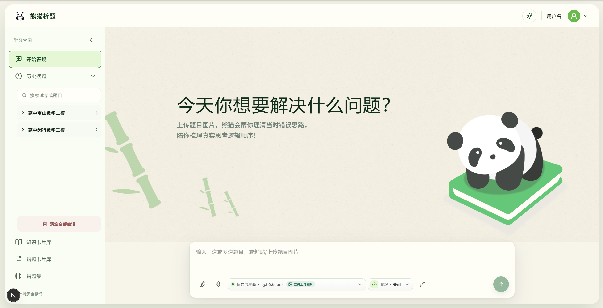
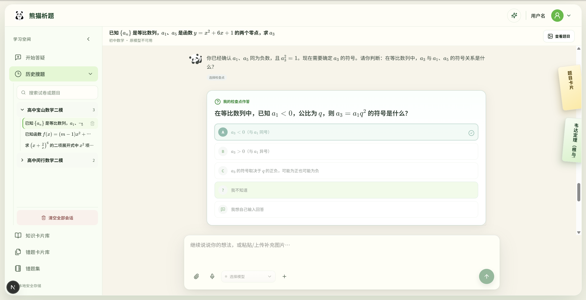
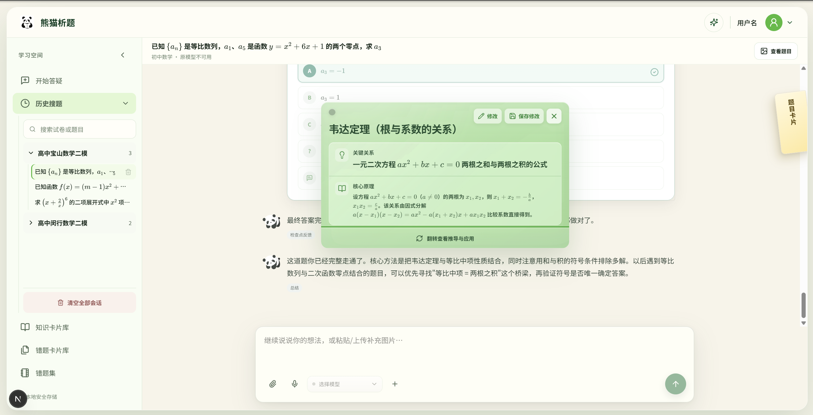
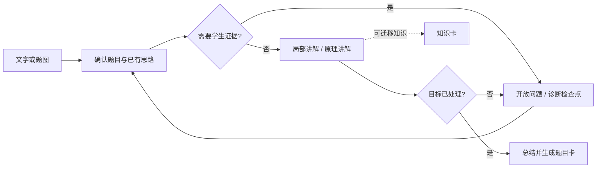

<p align="center">
  
</p>

<h1 align="center">熊猫析题</h1>

<p align="center">
  <strong>先找到学生真正卡住的地方，再提问、讲解、检查和总结。</strong><br>
  Windows 优先、数据留在本机的诊断式数学答疑应用。
</p>

<p align="center">
  <a href="https://github.com/robbinpanda/Diagnostic-teaching/releases/tag/v0.6.1"></a>
  <a href="https://github.com/robbinpanda/Diagnostic-teaching/releases"></a>
  <a href="./docs/database.md"></a>
  <a href="./compose.local.yml"></a>
</p>



<p align="center"><sub>输入一道或多道题，也可以粘贴、上传并框选题图。</sub></p>

## 这不是一个直接给答案的聊天窗口

熊猫析题把一次答疑拆成可验证的教学动作：先确认题目与已有思路，再用开放问题或诊断选择题定位卡点；讲解只推进当前需要的一小步，最后把过程沉淀为可以复习的知识卡和题目卡。

| 诊断卡点 | 保持参与 | 沉淀复习 |
|---|---|---|
| 先收集题目和学生思路，不凭消息顺序猜测上下文 | 用开放问题、诊断选项和“我不知道”持续获取理解证据 | 自动生成知识卡、题目卡，按试卷归档并支持 PDF/练习模式 |

## 一次真实答疑如何进行

1. **输入题目**：粘贴文字，或上传 PNG/JPEG/WebP 题图；多题会拆成独立会话。
2. **说明思路**：学生可以写下已做到哪一步，也可以直接说明“完全没思路”。
3. **定位卡点**：系统用开放问题或三选一诊断检查点，确认错误发生在哪个连接上。
4. **小步讲解**：一次只修复一个局部步骤，或讲清一个可迁移的数学原理。
5. **检查与总结**：学生完成关键判断后，系统收束本题，并生成可归档的学习卡片。

### 诊断检查点



检查点不是为了“考试”，而是用三个有诊断意义的选项快速区分理解、误区和不确定状态。学生也可以选择“我不知道”，或直接输入自己的回答。

### 从讲解到知识卡



值得迁移复用的公式、定理和方法会生成知识卡；当前题目的完整条件、步骤与答案则进入题目卡。卡片可以编辑、按试卷归档、跨卷选择并导出。

## 核心能力

| 能力 | 说明 |
|---|---|
| 文字与题图输入 | 支持单题、多题拆分，以及题图检测、框选、裁剪和批量建会话 |
| 诊断式教学 | 只允许六种受约束教学动作，避免模型一路代做整题 |
| 多会话工作台 | 不同会话可并行生成、停止、恢复和继续追问 |
| 学习资产 | 知识卡、题目卡、试卷归档、错题卡片库、错题集和双列打印 |
| 自选模型 | 支持 OpenAI Responses、OpenAI-compatible Chat Completions 与 Anthropic Messages；应用不内置公共 API 凭据 |
| 本地语音 | 可选 SenseVoiceSmall 流式语音输入，识别结果先回填输入框再由学生确认发送 |
| 可靠恢复 | SQLite 保存会话、输入、生成 run、检查点和卡片；刷新或重启后可恢复已提交状态 |

完整能力边界和端到端数据流见 [系统总览](./docs/system-overview.md)。

## 快速开始

### 方式一：Windows 安装版

从 [GitHub Releases](https://github.com/robbinpanda/Diagnostic-teaching/releases/latest) 下载 `Diagnostic-Teaching-Setup-0.6.1-x64.exe`。安装版已经包含前后端、Python 运行时和语音依赖，不要求另装 Node.js、Python、Conda 或 SQLite。

> 安装包尚未商业签名，Windows SmartScreen 可能提示“未知发布者”。0.5.0 引入的一次性旧数据清理合同仍然有效；已经运行过 0.5.0 的用户升级到 0.6.1 不会再次清理。详见 [Windows 安装说明](./docs/windows-installer.md)。

### 方式二：源码运行

需要 Windows、Miniconda/Anaconda、Node.js 20+ 和 npm：

```powershell
git clone https://github.com/robbinpanda/Diagnostic-teaching.git
cd Diagnostic-teaching
git switch main
conda create -n ai4edu-tutor python=3.11 -y
conda run -n ai4edu-tutor python scripts/install-python-deps.py dev
npm --prefix apps/web install
.\scripts\start-dev.cmd
```

浏览器打开 <http://127.0.0.1:3000>。停止服务时运行 `scripts\stop-dev.cmd`。环境变量、语音模型与故障排查见 [本地运行指南](./docs/how-to-run.md)。

### 方式三：Docker

轻量版（不包含本地语音依赖）：

```powershell
docker compose -f compose.local.yml up -d --build
```

CPU 语音版：

```powershell
docker compose -f compose.local.yml -f compose.speech.yml up -d --build
```

Docker 默认只监听 `127.0.0.1:3000`。当前 API 不提供多用户认证，请勿直接暴露到局域网或公网。

## 教学工作流



正式答疑只使用以下六种 action：

| action | 职责 | 是否等待学生 |
|---|---|---|
| `ASK_OPEN_QUESTION` | 获取不能由选项替代的学生证据 | 是 |
| `ASK_MULTIPLE_CHOICE` | 用三个诊断选项定位理解或误区 | 是 |
| `EXPLAIN_LOCAL` | 只修复一个具体步骤或局部连接 | 否 |
| `EXPLAIN_PRINCIPLE` | 只讲一个可迁移原理 | 否 |
| `RESPOND_TO_CHECKPOINT` | 对检查点结果提供简短反馈 | 否 |
| `SUMMARIZE` | 在目标确已处理后收束并生成题目卡 | 否 |

`wait_for_student` 始终由后端根据 action 推导，不交给模型自由决定。详细合同见 [教学状态机](./docs/state-machine.md)。

## 架构与可靠性

```text
Next.js 工作台
    │  HTTP / SSE / WebSocket
    ▼
FastAPI ─────── 模型供应商 API
    │
    ├── SQLite：唯一可恢复业务态
    └── JSONL / Markdown：只追加诊断日志
```

- 学生消息和卡片继续命令先通过 `session_inputs` 幂等接纳，再启动生成；网络重试复用原客户端幂等键。
- `session_runs` 记录生成生命周期；同一 session 串行，不同 session 可以并行。
- 完整 action、检查点、卡片和 durable events 在同一业务事务边界提交；流式半成品不进入历史。
- 含题图的 session 固定绑定多模态模型，并保留原始 `problem_image_data_url` 供后续轮次使用。
- API key 只在后端加密存储，不进入前端持久化、诊断日志或 Git。

## 仓库结构

```text
apps/api/       FastAPI、教学控制、模型适配、SQLite 仓储与迁移
apps/web/       Next.js 工作台、前端状态机、流控制和打印视图
config/         内置模型配置
docs/           架构、运行手册、接口合同与改动记录
scripts/        Windows 开发、诊断和打包脚本
data/           本地 SQLite 与加密密钥（Git 忽略）
logs/           JSONL/Markdown 诊断日志（Git 忽略）
runtime/        Docker 持久化数据与模型缓存（Git 忽略）
```

## 开发验证

后端：

```powershell
cd apps/api
python -m ruff check .
python -m pytest -q
```

前端：

```powershell
cd apps/web
npm run lint
npm run typecheck
npm test
```

涉及构建、路由或样式合同时，再运行 `npm run build`。核心 Python 依赖由 `apps/api/requirements-core.in` 声明，并由带哈希的 `requirements-core.txt` 锁定；请使用 `scripts/install-python-deps.py` 和 `scripts\lock-python-deps.cmd` 管理，不要手工编辑生成的锁文件。

## 文档导航

| 文档 | 适合在什么时候读 |
|---|---|
| [系统总览](./docs/system-overview.md) | 第一次了解组件职责和端到端流程 |
| [教学状态机](./docs/state-machine.md) | 修改 prompt、action、检查点或卡片规则 |
| [上下文管理](./docs/context-management.md) | 修改输入接纳、会话恢复、run 或诊断日志 |
| [Session 事件](./docs/session-events.md) | 修改 durable event 与 SSE 重放 |
| [数据库](./docs/database.md) | 修改表结构、迁移、备份与 SQLite 行为 |
| [模型配置](./docs/ai-model-config-v0.2.md) | 接入或排查模型供应商 |
| [本地运行](./docs/how-to-run.md) | 安装、启停、语音配置和故障排查 |
| [Windows 安装](./docs/windows-installer.md) | 构建安装包、升级或处理签名提示 |

产品范围见 [PRODUCT.md](./PRODUCT.md)，当前视觉与交互合同见 [DESIGN.md](./DESIGN.md)，完整文档索引见 [docs/README.md](./docs/README.md)。

## 数据与隐私

SQLite 是 session 恢复的唯一权威来源。`logs/sessions/` 下的 JSONL 与 Markdown 仅用于本地诊断，不参与业务恢复。真实 `.env`、`data/`、`logs/` 和 `runtime/` 均不应提交到 Git。
