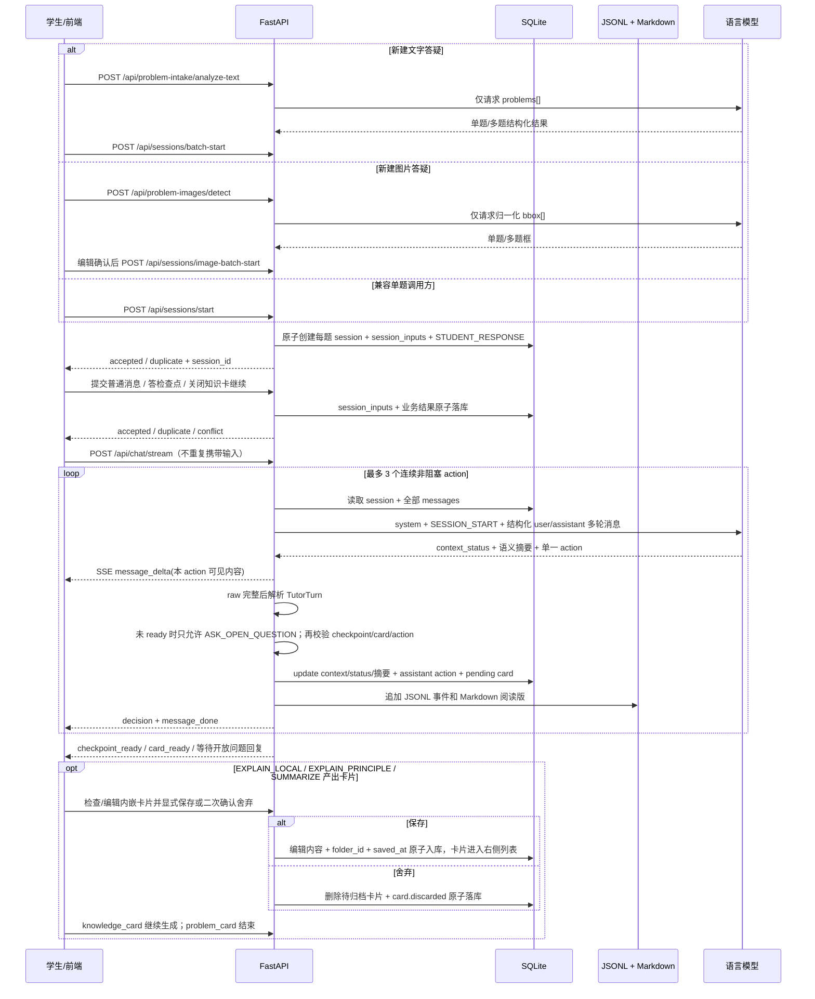

# 答疑状态机与 LLM 主导流程

版本：v1.6
日期：2026-07-23
适用项目：诊断式数学答疑 MVP

本文档说明当前答疑流程的真实运行方式：**后端不写死数学解题分支，但会强制执行上下文收集与教学动作工作流。LLM 每次只输出一个结构化 `TutorTurn` 原子动作，同时判断 `context_status` 并提供可靠的新语义摘要；后端在上下文未 ready 时只允许开放提问，ready 后再根据 action 推导 `wait_for_student`，并在非阻塞动作之间做 bounded loop。`EXPLAIN_PRINCIPLE` 必须产生 `knowledge_card`，`EXPLAIN_LOCAL` 可按知识复用价值选择产生 `knowledge_card`，`SUMMARIZE` 必须产生 `problem_card`。**

如果后续要优化教学策略，优先改：

- `apps/api/app/core/teaching_controller.py` 的 `SYSTEM_PROMPT` 和 `JSON_CONTRACT`
- `apply_backend_action_policy()` 的 action 归一化与等待规则
- `MAX_NONBLOCKING_ACTIONS` 的 bounded loop 上限
- `validate_checkpoint()` 的检查点质量约束
- `build_messages()` 拼给模型的上下文
- `ACTION_PROTOCOL` 的 action 用途、格式和阻塞说明

## 1. 总体闭环



关键点：

- 没有正式 session 内的前置教学 intake。文字草稿和题图可以先经过只决定 session 数量的拆题或框选阶段；兼容的单题 `/start` 调用，以及拆题/框选确认后的每个子题，才在接纳事务中创建正式 session，并与对应 `session_inputs`、`STUDENT_RESPONSE` message 原子落库。客户端提供稳定 session id 和 `client_message_id`，相同请求重试返回原结果。
- `context_status` 取 `need_problem / need_thought / ready`。模型依据完整对话语义更新 `problem_summary / student_thought_summary`，后端把它们与 assistant action 原子写回 `sessions.problem_text / student_initial_thought`。不得按消息序号猜测字段。
- `need_problem` 或 `need_thought` 时后端清除 checkpoint/card，并强制 action 为 `ASK_OPEN_QUESTION`；只有 `ready` 后才能讲解、出选择题、总结或生成卡片。“完全没思路”是有效的思路状态，可以进入 ready，但它只表示诊断信息已收齐，不表示教学已完成。system prompt 明确要求最新学生仍表达不会、没思路、不理解或无法开始时先降低台阶教学、不得直接 `SUMMARIZE`；具体语义由模型结合完整对话判断，后端不使用中文关键词正则拦截 action。模型明确输出 `ready` 且题目已经存在时，后端不会仅因本轮省略可选的 `student_thought_summary` 而退回 `need_thought`。
- 正式 session 的输入接纳和模型生成是两个服务边界。`POST /api/sessions/{session_id}/inputs` 与 checkpoint answer 接口先把输入及其业务结果写入 SQLite；`POST /api/chat/stream` 再从权威历史生成。客户端断开 SSE 不会使已经接纳的输入消失。
- 题目与思路可在同一条或任意多条消息中、以任意顺序提供；标签只帮助语义理解，不决定字段。寒暄、表情和无关文字不能成为题目或思路摘要。
- LLM 每轮决定 `state_hint`、`action`、`message`、`breakpoint_description`、`checkpoint`、`knowledge_card`、`problem_card`。
- 后端不信任模型给出的等待判断；`wait_for_student` 由后端根据 action 强制推导。
- `ASK_OPEN_QUESTION` 和 `ASK_MULTIPLE_CHOICE` 是阻塞动作，会停下等待学生。`ASK_MULTIPLE_CHOICE` 等待期间仍允许学生在输入框直接输入原文；文字提交会原子结束当前 checkpoint，并作为普通学生消息进入后续教学。
- `EXPLAIN_LOCAL`、`EXPLAIN_PRINCIPLE`、`RESPOND_TO_CHECKPOINT` 是教学语义上的非阻塞动作。`RESPOND_TO_CHECKPOINT` 直接继续；`EXPLAIN_PRINCIPLE` 必须内嵌展示 `knowledge_card`，`EXPLAIN_LOCAL` 仅在模型判断本次内容值得独立记忆和迁移复用时展示，确认归档后继续。
- knowledge/problem card 出现后不锁住输入框。学生先发送问题时，后端原子暂存卡片并继续生成，前端保留一张可折叠的待处理卡片；该卡片解决前禁止再生成新卡。稍后保存或舍弃暂存卡片不会重复启动续讲。
- knowledge card 只保存脱离当前题仍成立的公式、定理、性质或通用方法；problem card 只保存当前具体题目的条件、完整步骤和最终答案。整题依赖的可迁移原理已讲清但尚未制卡时，先生成知识卡，再在后续 `SUMMARIZE` 生成题目卡；同一道题允许各有一张。
- message、checkpoint 和两类卡片的所有可见字段统一使用纯文本 + KaTeX：短公式用 `$...$`，关键推导可用 `$$...$$` 独立成行，不使用界面不会解释的 Markdown 标题或列表。卡片合同额外拒绝定界符外明显的下标、上标、方程和数学符号，并触发一次带具体格式说明的模型重试。
- 连续 3 个非阻塞动作后，下一轮 prompt 会要求模型在“自然总结”和“获取必要的新证据”之间选择；若仍输出非阻塞动作，后端会转成 `ASK_OPEN_QUESTION`。
- `SUMMARIZE` 是终止动作，不等待学生回答，但会内嵌展示 `problem_card`；确认归档后流程结束。
- `SUMMARIZE` 不要求学生先独立给出最终答案，也不要求额外插入确认性问题；当前结论或卡点已经讲清即可自然收束。
- 项目不主动截断、压缩或摘要历史；模型供应商自身的硬上下文限制仍然存在。
- AI 正在流式输出时，学生仍可输入。发送新问题会显式中断 run，把已展示片段持久化为“讲解被新问题打断”，再按原文接纳学生消息；单独点击停止仍按取消处理，不保存半截输出。
- 打断原文会开启一层支线并获得最高优先级；支线解决前不得总结或接续原讲解。模型标记支线解决后自动从断点继续，学生也可以点击“回到原讲解”提前返回；支线中的解释和作答全部保留在后续模型历史中。

## 2. LLM 输出合同：TutorTurn

每一次 LLM 调用只产出一个教学原子动作：

```json
{
  "message": "给学生看的中文内容，固定放在第一个字段",
  "action": "ASK_OPEN_QUESTION",
  "context_status": "need_problem|need_thought|ready",
  "state_hint": "diagnosing"
}
```

这是按 action 区分的联合合同，不是要求所有 action 输出同一组占位字段。公共字段为 `message / action / context_status / state_hint`；摘要和断点只在确有信息时出现。

动作与结构化字段必须严格匹配：

- `context_status != ready`：只允许 `ASK_OPEN_QUESTION`，不输出 checkpoint/card 字段。
- `problem_summary / student_thought_summary`：仅保存从真实对话确认的信息；本轮没有可靠新增时省略，不会用寒暄覆盖已确认摘要。

- `ASK_MULTIPLE_CHOICE`：只增加非空 `checkpoint`。
- `EXPLAIN_LOCAL`：仅当 message 含值得独立记忆、可迁移的公式、定理、性质或方法辨析时增加 `knowledge_card`。
- `EXPLAIN_PRINCIPLE`：必须增加 `knowledge_card`。
- `SUMMARIZE`：必须增加 `problem_card`。
- 其余 action：不输出三个结构化附属字段。

后端的 `TutorTurn` schema 仍把缺失附属字段补为 `None`，现有存储、校验和前端数据结构不变。最新消息是尚未回应的 `CHECKPOINT_RESPONSE` 时，prompt 会进一步缩成只允许 `RESPOND_TO_CHECKPOINT` 的小合同；上下文仍可能被最新学生消息补齐时保留完整 action 选择，避免多制造一轮追问。

代码对应：

- schema：`apps/api/app/core/schemas.py:TutorTurn`
- prompt 合同：`apps/api/app/core/teaching_controller.py:JSON_CONTRACT`
- 解析入口：`extract_json_object()` + `TutorTurn.model_validate()`
- 后端动作策略：`apply_backend_action_policy()`
- 流式生成：`generate_tutor_turn_stream()`

兼容说明：旧模型或旧日志里的 `phase` 仍可被解析为 `state_hint`，但新接口和新日志使用 `state_hint`。

## 3. state_hint 只是状态提示

`state_hint` 不是流程控制器，它的作用是给下一轮 LLM 一个教学状态提示，帮助模型理解当前大概处于诊断、搭脚手架、恢复、总结等阶段。

| state_hint | 语义 |
|---|---|
| `diagnosing` | 诊断卡点 |
| `scaffolding` | 脚手架推进 |
| `explaining` | 局部讲解 |
| `checking` | 检查理解 |
| `recovering` | 错误/不知道后的恢复 |
| `summarizing` | 收尾总结 |

底层 SQLite 目前仍使用 `sessions.phase` 作为兼容存储列；业务接口和 prompt 中把它解释为 `state_hint`。

## 4. action 是真正的教学动作

`action` 现在是工作流控制的核心字段。

system prompt 会在 `ACTION_PROTOCOL` 中逐项告诉模型每个 action 的功能、必需字段、阻塞性和后端行为。action 只是教学控制协议，不是外部 tool call。

| action | 类型 | 后端行为 |
|---|---|---|
| `EXPLAIN_LOCAL` | 非阻塞；可选卡片确认 | 针对学生当前具体卡点；若其中包含可复用的公式、定理、性质或方法辨析，可输出 `knowledge_card` 并在关闭归档后继续 |
| `EXPLAIN_PRINCIPLE` | 非阻塞 + 卡片确认 | 从定义和原理出发讲清一个知识点，输出 `knowledge_card`，关闭归档后继续 |
| `RESPOND_TO_CHECKPOINT` | 非阻塞 | 闭环当前待处理的选择结果，指出理解证据或误区，并提供具体、真诚的情绪支持 |
| `ASK_OPEN_QUESTION` | 阻塞 | 展示开放问题，`wait_for_student=true`，等待学生输入 |
| `ASK_MULTIPLE_CHOICE` | 阻塞 | 要求存在合法 checkpoint，用三个可诊断选项定位学生误区 |
| `SUMMARIZE` | 终止 + 卡片确认 | 仅在教学目标已实际处理时自然总结并输出整题上帝视角解法的 `problem_card`，关闭归档后结束；prompt 要求学生最新仍明确表示不会或无法开始时不要使用 |

后端会做动作归一化：

- 有 `checkpoint` 但 action 不是 `ASK_MULTIPLE_CHOICE`：改成 `ASK_MULTIPLE_CHOICE`。
- `ASK_MULTIPLE_CHOICE` 但没有合法 checkpoint：降级为 `EXPLAIN_LOCAL`。
- 模型输出未知 action：降级为 `EXPLAIN_LOCAL`。
- 强制阻塞轮仍输出非阻塞 action：改成 `ASK_OPEN_QUESTION`，并补一句让学生回答的问题。

## 5. wait_for_student 由后端推导

模型不需要也不应该决定 `wait_for_student`。后端规则固定为：

```text
ASK_OPEN_QUESTION       -> wait_for_student = true
ASK_MULTIPLE_CHOICE     -> wait_for_student = true，前提是 checkpoint 合法
SUMMARIZE               -> wait_for_student = false，终止本轮 stream
EXPLAIN_PRINCIPLE       -> wait_for_student = false，但在 card_ready 后暂停 HTTP stream，等待关闭归档
EXPLAIN_LOCAL           -> wait_for_student = false；若输出 knowledge_card，同样在 card_ready 后暂停
其他非阻塞 action       -> wait_for_student = false，继续 loop
```

这样避免模型把“讲解动作”误标成等待，也避免 `EXPLAIN_LOCAL + checkpoint` 这种旧式混合动作继续扩散。

## 6. bounded loop 如何运行

`POST /api/chat/stream` 不再只调用一次 LLM。它会循环：

```text
读取最新 history
-> 调 LLM 生成一个 TutorTurn
-> 流式展示 message
-> 解析和校验 action/checkpoint
-> 写 assistant message 和 JSONL tutor_turn
-> 发 decision
-> 发 message_done
-> 如果 wait_for_student、SUMMARIZE 或产生 card：停止当前 HTTP stream
-> knowledge_card 关闭归档后，由前端发起无新 student message 的继续生成
-> 否则继续下一轮
```

连续非阻塞动作最多 3 个。第 4 次调用会带上收束提示：

```text
本轮已经连续执行了 3 个非阻塞教学动作；
若当前问题或卡点已经清楚处理，直接选择 SUMMARIZE；
否则选择 ASK_OPEN_QUESTION 或 ASK_MULTIPLE_CHOICE 获取必要的新证据。
```

因此模型可以形成更丰富的教学链路，例如：

```text
RESPOND_TO_CHECKPOINT
-> EXPLAIN_PRINCIPLE
-> SUMMARIZE
```

当现有信息不足以收束时，讲解后仍可进入 `ASK_MULTIPLE_CHOICE` 或 `ASK_OPEN_QUESTION`；确认题不再是每条链路进入总结前的固定关卡。

## 7. 检查点如何反馈给 LLM

学生可点击选项，也可直接输入自由文字回应检查点。两条路径都会先持久化输入，再继续生成。

自由文字路径复用普通 `STUDENT_MESSAGE` 接纳，并在同一事务中把原文写入 `checkpoints.free_text_response`、设置 `answered_at`、写入学生原文 message 和 `checkpoint.completed(response_mode=free_text)` durable event。它不设置 `selected_option_id/is_correct`，因此不会伪造正误判断；刷新后不再恢复为待答 checkpoint，之后再选选项会返回冲突。

选项路径仍有“保存答案”和“继续生成”两个请求，但学生结果只入库一次：

1. `POST /api/checkpoints/{id}/answer`
   - 以 checkpoint id 作为一次性幂等范围，在 `session_inputs` 写 `CHECKPOINT_ANSWER`
   - 写 `selected_option_id / is_correct / elapsed_ms`
   - `CHECKPOINT_CORRECT -> next_state_hint = scaffolding`
   - `CHECKPOINT_WRONG -> next_state_hint = recovering`
   - `CHECKPOINT_UNKNOWN -> next_state_hint = recovering`
   - 同时直接写 role=`student`、action=`CHECKPOINT_RESPONSE` 的 message
   - metadata 保存结构化 `checkpoint_result`
   - `in_reply_to_action_id` 指向产生检查点的 `ASK_MULTIPLE_CHOICE`
   - 首次回答成功后，同一选项重试返回第一次的 `input_id / action_id / student_message`；不同选项重试返回 `409 CHECKPOINT_ANSWER_CONFLICT`

2. 前端立刻再调 `POST /api/chat/stream`
   - 不再重复提交 message
   - 后端从 SQLite 完整 history 中读取刚保存的 `checkpoint_result`

checkpoint 类似一次需要结果的调用，但结果来自学生，而不是电脑工具。下一轮 LLM 同时看到可读的学生选择和结构化的正误、误区、耗时、event 与 next_state_hint。

前端不把 `CHECKPOINT_RESPONSE.content` 的内部可读文本直接渲染成普通学生气泡。实时提交时使用当前 checkpoint 与 answer 响应生成一张锁定的用户作答卡片；`GET /api/sessions/{id}` 和显式 restore 会把 message metadata 与对应 checkpoint 行重新组合为 `messages[].checkpoint_result`。因此提交后以及重新打开历史时都保留原题、全部选项和学生选择；选对的已选项标绿，选错的已选项标红，但不会向前端泄露其他选项的 `is_correct/misconception`。

普通开放消息使用同一 durable input 边界：前端生成 `client_message_id` 后调用 `POST /api/sessions/{session_id}/inputs`。`(session_id, client_message_id)` 在 SQLite 唯一；同 ID 同内容是安全重试，同 ID 不同内容是 409 冲突。兼容入口 `/api/chat/stream` 仍接受 message，但内部同样先调用输入接纳服务，再尝试占用生成锁。

## 8. knowledge_card 与 problem_card

两类卡片共用 `study_cards` 表，但内容合同不同：

- `knowledge_card`：`title / knowledge_point / core_idea / derivation_steps / when_to_use / common_mistakes / connection_to_problem`。
- `problem_card`：`title / problem_summary / solution_overview / solution_steps / pitfalls / how_to_think / final_answer`。

`EXPLAIN_PRINCIPLE` 必须输出 knowledge card；`EXPLAIN_LOCAL` 由模型判断是否输出。局部讲解中易混且可迁移的辨析（例如韦达定理“和用 $-b/a$、积用 $c/a$”）适合出卡；一次性代入、算术计算、符号改写或纯本题过渡不出卡。可选卡仍必须结构化 message 中的同一个知识点，不得扩大讲解范围。

生成 action、assistant message 和待归档 card 在一个 SQLite 事务中写入。新卡片最初 `saved_at=null` 并预绑定默认文件夹。知识卡片随消息时间线内嵌展示，保存时带最终 `content/folder_id` 的 `CARD_DISMISSED_CONTINUE` 原子更新内容、位置与归档时间；二次确认舍弃会写控制命令后删除待归档卡片。Problem card 选择位置后只归档、不继续。未解决的待归档卡片存在时，`/api/chat/stream` 返回 409。

全局卡片库中的查看不属于阻塞教学工作流；已归档 knowledge card 可在右侧浮层中编辑并通过 `PUT /api/cards/{id}` 更新。

Checkpoint 同样嵌入消息时间线，只有点击“提交答案”才调用 answer 接口。

卡片接口：

```text
GET    /api/cards?card_type=knowledge_card|problem_card
POST   /api/cards/{card_id}/save
PUT    /api/cards/{card_id}              # 修改已归档 knowledge card
POST   /api/sessions/{session_id}/inputs  # CARD_DISMISSED_CONTINUE
DELETE /api/cards
DELETE /api/cards/{card_id}
```

`DELETE /api/cards` 会清空全部已归档和待归档卡片，但不删除 session、message、checkpoint 或日志。`session_id` 仍保存在卡片记录中作为来源审计字段，但全局卡片库的查询与删除不依赖当前会话。新建、恢复或删除 session 都不会清空已归档卡片；只有 `saved_at=null` 的待归档卡片仍属于原会话的阻塞工作流。

## 9. SSE 事件顺序与 durable 边界

一次 `/api/chat/stream` 可能包含多个 action。每个 action 都会有自己的事件段：

```text
progress        × N  # 固定安全阶段文案，不含原始 CoT
message_delta   × N
decision
checkpoint_ready?  # 仅 ASK_MULTIPLE_CHOICE 且 checkpoint 合法
card_ready?        # EXPLAIN_LOCAL（可选）/ EXPLAIN_PRINCIPLE / SUMMARIZE 且 card 合法
message_done
```

阶段依次为 `reading_problem / checking_thought / choosing_action / composing_reply`。并非每个 provider 都会返回 reasoning 事件，因此中间阶段允许跳过；前端始终至少从 run 启动显示“正在读取题目”。

`message_done` 在卡片 action 中额外带 `awaiting_card_dismissal=true`；只要卡片是 `knowledge_card`（来自 `EXPLAIN_LOCAL` 或 `EXPLAIN_PRINCIPLE`），`continue_after_card=true`；`problem_card` 为 false。

`decision` 包含：

```json
{
  "state_hint": "scaffolding",
  "action": "EXPLAIN_LOCAL",
  "wait_for_student": false,
  "message": "本 action 的完整可见内容",
  "breakpoint": "当前卡点",
  "confidence": 0.8,
  "action_index": 0
}
```

前端收到 `message_done` 后会把下一个 action 开成新的 assistant 气泡，避免多个 LLM 调用的文本糊成一段。

上面是 `POST /api/chat/stream` 的当前请求内事件，`message_delta/message_reset` 不保证断线重放。后端同时把稳定业务边界写入 SQLite `session_events`：

```text
run.started
message.completed        # 完整 student/assistant message
action.completed         # 后端归一化后的 action
checkpoint.ready? / card.ready?
run.completed
session.idle
```

checkpoint answer 会在原子事务中依次追加 `checkpoint.completed` 和对应的 student `message.completed`；卡片归档追加 `card.saved`，舍弃追加 `card.discarded`。run 失败时追加 `error.occurred -> run.completed(status=failed) -> session.idle`。

`GET /api/sessions/{session_id}/events/stream` 用 `after_seq` 或 `Last-Event-ID` 先补齐遗漏事件再持续订阅。同一 session 的 `seq` 严格递增；客户端重复收到相同 `seq` 时只应用一次。这个 change feed 不改变六个教学 action，也不让模型控制 `wait_for_student`。完整合同见 `docs/session-events.md`。

前端不再直接在页面组件里拼接这些事件。原始 SSE 先被适配为绑定 `sessionId + runId` 的事件，再进入 timeline reducer；composer、run、checkpoint、card 则由一个判别联合状态机保证当前视图内互斥。stream controller 按 session 保存独立的 `AbortController`，因此不同 session 可以在同一浏览器标签页中并行生成。当前确定性规则为：

- 事件的 session 或 run 与当前视图不匹配时不会修改当前 timeline；切换 session 或新建答疑只换视图，不 abort 其他 session 的 fetch。重新打开仍在生成的 session 时，先加载 SQLite 快照，再按该 session 的本地活动 run 重新接收后续事件。
- 同一 session 启动新 run 时只 supersede 该 session 的旧 fetch；不同 session 不互相取消。显式停止只对当前打开的 session 先请求服务端 interrupt，再收束对应本地 fetch；页面卸载才取消全部本地连接。
- 图片上传先只做题目框检测，不预建 session。检测结果仅在原草稿视图仍有效时打开编辑确认页；用户可以新增、删除、平移或缩放题目框，确认后前端才为每个最终框分配稳定 session/message id，后端裁剪并原子批量创建。第一题绑定当前视图，其余 session 可并行生成；取消或切走检测草稿不会留下空 session。
- `decision` 负责用后端最终 message/action 校准当前气泡；`message_reset` 只重置当前未完成 action 的重试拼接；`message_done` 后同 action 的迟到 delta/decision/reset 不再修改已完成消息。
- checkpoint/card 采用 first-wins，同 ID 重复通知不重复打开交互；error 终止当前 run，但保留进入下一次 run 的恢复路径。
- session-events SSE 已通过 `id`/`seq` 重放稳定业务边界；chat SSE 的高频 delta 仍可能不带身份。reducer 会去重已有序号并记录缺口，未带 id/seq 的 delta 严格按到达顺序拼接，不能据此声称字符流 exactly-once。

## 10. 日志口径

每次 LLM 调用都会同时追加严格 JSONL 和留白充足的 Markdown。JSONL 中每一次调用单独写一条 `tutor_turn`：

- `prompt_messages`
- `raw_response`
- `parsed_turn`
- `latency_ms`
- `parse_ok`
- `used_fallback`
- `error`

所以 bounded loop 中的每个 action 都能单独复盘。检查点答案事件使用 `next_state_hint` 记录后端预置的下一轮状态提示。两种日志都不参与 session 恢复；历史恢复只读 SQLite。

做运行分析时优先看：

1. 每条 `tutor_turn.parsed_turn.action`
2. `wait_for_student`
3. `checkpoint != null`
4. 是否有 `used_fallback`
5. 连续非阻塞动作是否超过预期
6. 检查点答案后的下一轮是否真正响应学生选择

## 11. fallback 与容错

当前后端仍保留几层容错：

- `strip_code_fence()` 去掉 markdown fence。
- `extract_json_object()` 从文本中截取最外层 JSON。
- `repair_unescaped_string_field(text, "message")` 修复 message 内部未转义引号。
- `recover_tutor_turn_from_raw()` 在 JSON 解析失败时恢复最小可用 turn。
- `validate_checkpoint()` 移除不合格 checkpoint。
- `apply_backend_action_policy()` 修正 action/checkpoint/wait 的不一致。

需要注意：fallback 后可能丢失原本 raw 中的 checkpoint，所以分析时不能只看 raw，也要看最终 `parsed_turn.checkpoint`。

## 12. 会话 run 生命周期、中断与重启恢复

一次 `POST /api/chat/stream` 是一个 run；一个 run 内仍可由 bounded loop 连续提交多个完整教学 action。SQLite `session_runs` 保存：

```text
id(run_id) / session_id / attempt / status
queued_at / started_at / finished_at / updated_at
error_json / last_committed_action_index
```

状态只能是 `queued / running / completed / failed / interrupted`：

- API 接到合法请求后先原子分配同 session 递增的 `attempt` 并写 `queued`。
- coordinator 给每个 session 独立的 FIFO 执行锁：同 session 串行，不同 session 不共享锁、可并行；取得锁后转 `running`。
- run 到达开放问题、选择题、待归档卡片或总结等正常停止点时转 `completed`。
- provider/解析/存储异常转 `failed`，`error_json` 至少包含 `code / message / type / retryable`。
- `POST /api/sessions/{session_id}/interrupt` 先把该 session 当前 queued/running run 原子标为 `interrupted`，再取消 provider 子任务；这会阻止当前 action 提交并停止后续 bounded loop。空闲中断和重复中断返回成功但 `interrupted=false`。

完整 action 的提交与显式中断争用同一个 SQLite 写事务。若 action 事务先完成，它作为完整 assistant message 保留；若 interrupt 先完成，run 状态门闩拒绝该 step 入库。因此 SSE 已显示的半截 `message_delta` 从不等于完整业务 action，前端收到 `run_interrupted` 或 error 时会移除当前未提交气泡。

客户端停止读取响应与显式中断是两条不同语义：ASGI 响应任务被客户端断开取消时，服务端同样清理 provider 子任务和 coordinator，但 run 记为 `failed`，错误码为 `client_disconnected`；只有 interrupt API 才产生 `interrupted / explicit_interrupt`。

应用启动不会续跑旧进程的 provider 调用。启动初始化会扫描遗留 `queued/running` run，并标为 `failed / process_restarted`，保留原先 status 到结构化错误的 `previous_status` 中。用户可在确认 SQLite 已提交 action 后显式发起新 attempt。

相关接口与流事件：

```text
GET  /api/sessions/{session_id}/run
POST /api/sessions/{session_id}/interrupt

X-Run-Id: run_...
run_started -> message_delta... -> decision... -> message_done
run_interrupted  # 仅显式中断
error            # failed run
```

`session_runs` 由 Alembic `apps/api/migrations/versions/0004_session_runs.py` 创建，并通过 `down_revision` 接在 session event 迁移之后。后续只扩展这条统一迁移链，不要恢复运行时建表或建立第二套 run 表。

## 13. 一句话结论

当前流程已经从“LLM 自选 phase/action/checkpoint 的软状态机”升级为“LLM 产出教学原子动作，后端强制 action 工作流”的结构：`state_hint` 只负责提示，`action` 决定控制流，`wait_for_student` 由后端推导，bounded loop 负责把多个非阻塞讲解动作串起来，直到真正需要学生参与。
