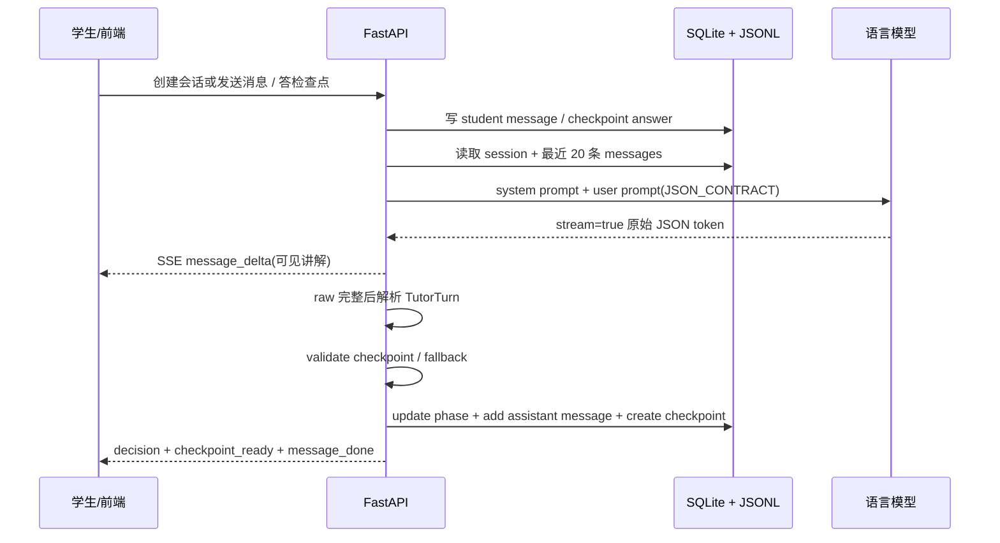

# 答疑状态机与 LLM 主导流程

版本：v0.5
日期：2026-07-08
适用项目：诊断式数学答疑 MVP

本文档说明当前答疑流程的真实运行方式：**状态机不是后端写死的脚本，而是每一轮由语言模型输出结构化 `TutorTurn` 决策，后端负责校验、落库、日志和兜底，前端负责展示与检查点交互。**

如果后续要优化教学策略，优先改：

- `apps/api/app/core/teaching_controller.py` 的 `SYSTEM_PROMPT` 和 `JSON_CONTRACT`
- `validate_checkpoint()` 的检查点质量约束
- `build_messages()` 拼给模型的上下文
- 前端 `handleCheckpoint()` 回传给模型的学生答题表达

## 1. 总体闭环



关键点：

- LLM 每轮决定 `phase`、`action`、`message`、`breakpoint_description`、`checkpoint`。
- 后端不根据题目内容写教学分支，只检查模型输出是否合法。
- SQLite 保存业务态，JSONL 保存完整诊断证据。
- 前端不会直接决定下一步教学，只把学生输入和检查点选择回传给后端。

## 2. LLM 输出合同：TutorTurn

每轮主链路都要求模型返回一个 JSON：

```json
{
  "phase": "diagnosing|scaffolding|explaining|checking|recovering|summarizing",
  "action": "ASK_OPEN_QUESTION|SHOW_CHECKPOINT_MC|DECOMPOSE_STEP|EXPLAIN_LOCAL|EXPLAIN_PRINCIPLE|RESPOND_TO_CHECKPOINT|SUMMARIZE",
  "message": "给学生看的中文内容",
  "breakpoint_description": "当前卡点，可为 null",
  "breakpoint_confidence": 0.0,
  "checkpoint": null,
  "debug": {}
}
```

代码对应：

- schema：`apps/api/app/core/schemas.py:TutorTurn`
- prompt 合同：`apps/api/app/core/teaching_controller.py:JSON_CONTRACT`
- 解析入口：`extract_json_object()` + `TutorTurn.model_validate()`
- 流式生成：`generate_tutor_turn_stream()`

`message` 是学生真正看到的讲解或提问。`checkpoint` 如果存在，会被前端弹成选择题。

## 3. phase 是模型的阶段判断

| phase | 语义 | 模型通常应该做什么 |
|---|---|---|
| `diagnosing` | 诊断卡点 | 判断学生卡在题意、概念、公式还是步骤 |
| `scaffolding` | 脚手架推进 | 给一小步提示，让学生自己跨过去 |
| `explaining` | 局部讲解 | 解释当前断点附近的一个概念或等式 |
| `checking` | 检查理解 | 生成和当前题强相关的选择题检查点 |
| `recovering` | 错误/不知道后的恢复 | 降低难度、讲原理、纠正常见误区 |
| `summarizing` | 收尾总结 | 串联关键步骤并给出最终结论 |

后端只把模型给出的 `phase` 写回 `sessions.phase`，并在下一轮 prompt 中提供：

```txt
当前阶段：{session['phase']}
```

所以 `phase` 的作用是给模型提供“上一轮它自己留下的教学状态”。它不是严格有限状态自动机，后端不会禁止 `diagnosing -> summarizing` 这种跳转；跳转质量主要由 prompt 和上下文控制。

## 4. action 是模型的教学动作

| action | 前端表现 | 后端处理 |
|---|---|---|
| `ASK_OPEN_QUESTION` | 显示一段问题，等待学生输入 | 仅保存 message |
| `SHOW_CHECKPOINT_MC` | 显示 message，并弹出选择题检查点 | 若 checkpoint 合法则创建 `checkpoints` 记录 |
| `DECOMPOSE_STEP` | 显示拆步提示 | 仅保存 message |
| `EXPLAIN_LOCAL` | 讲当前一个小点 | 仅保存 message |
| `EXPLAIN_PRINCIPLE` | 讲概念/定理/原理 | 仅保存 message |
| `RESPOND_TO_CHECKPOINT` | 针对刚才选项反馈 | 仅保存 message，或继续弹下一检查点 |
| `SUMMARIZE` | 总结整题 | 仅保存 message |

`action` 主要用于 debug 面板和后续分析，不直接决定渲染。真正触发弹窗的是 `checkpoint != null` 且通过后端校验。

## 5. 后端守门：validate_checkpoint

模型可以提议检查点，但不能绕过校验。

`validate_checkpoint()` 强约束：

- `options` 必须恰好 3 个
- 必须恰好 1 个正确选项
- 错误选项必须带 `misconception`
- `question` 不能是“懂了吗/听懂了吗/跟上了吗/理解了吗”这类元认知问题

如果模型返回了不合格 checkpoint：

- 后端移除 `turn.checkpoint`
- 如果 `action == SHOW_CHECKPOINT_MC`，降级为 `EXPLAIN_LOCAL`
- `turn.debug["checkpoint_removed"] = True`

这意味着：**LLM 主导流程，但检查点质量由后端兜底。**

## 6. 检查点如何反过来影响 LLM

学生答检查点不是直接驱动后端状态机继续讲，而是进入下一轮 LLM 上下文。

前端 `handleCheckpoint()` 做两步：

1. `POST /api/checkpoints/{id}/answer`
   - 写 `selected_option_id / is_correct / elapsed_ms`
   - `CHECKPOINT_CORRECT -> scaffolding`
   - `CHECKPOINT_WRONG -> recovering`
   - `CHECKPOINT_UNKNOWN -> recovering`

2. 立刻再调用 `POST /api/chat/stream`
   - message 形如：
     ```txt
     我在检查点「{checkpoint.question}」选了：{option.id} {option.text}
     ```
   - 这条消息以普通 `student` role 入库
   - metadata 中附带 `checkpoint_answer`

下一轮 prompt 里模型看到的是普通历史对话：

```txt
student: 我在检查点「若 a_1、a_5 是方程根...」选了：B $a_1 \cdot a_5 = 6$
```

因此模型能根据“学生选错了什么”决定是纠错、讲原理、降难度，还是继续推进。后端只预先把 session phase 写成 `recovering/scaffolding`，供模型参考。

## 7. 每轮 prompt 怎么让 LLM 主导

`build_messages(session, history)` 每轮只发两条 chat messages：

```txt
system: SYSTEM_PROMPT
user: 题目 + 学生初始思路 + 当前阶段 + 历史对话 + JSON_CONTRACT
```

`SYSTEM_PROMPT` 给模型角色和教学原则：

```txt
你是一个面向中国初高中学生的诊断式数学答疑老师。
目标不是从头完整讲题，而是先判断学生卡在哪里，再从断点附近推进。
```

再配 7 条强规则：

1. 检查理解时生成强相关选择题，不问“你懂了吗”
2. 检查点必须 3 选项，1 正 2 错
3. 单次讲解只讲一个关键点
4. 学生选“我不知道”要降难度或讲原理
5. 输出必须是 JSON
6. `message` 必须非空中文，可直接展示
7. 不要冗长思考，直接产出最终 JSON

这就是当前“教学状态机”的核心：**把教学策略写进 prompt，让模型每轮自选 phase/action/checkpoint；后端把输出约束成可运行的产品事件。**

## 8. SSE 事件顺序

`POST /api/chat/stream` 返回 text/event-stream：

```txt
message_delta   × N
decision
checkpoint_ready
message_done
```

事件含义：

- `message_delta`：从 LLM 原始 JSON 的 `"message"` 字段中实时抠出的可见字符。
- `decision`：完整 `TutorTurn` 解析后发送，包含 `phase/action/message/breakpoint/confidence`。
- `checkpoint_ready`：只有合法 checkpoint 才发送，且会裁掉 `is_correct/misconception`。
- `message_done`：本轮结束。
- `error`：模型/网络/解析兜底失败等可见错误。

为什么 `decision` 里也带 `message`：

- `message_delta` 是主路径，负责打字机体验。
- `decision.message` 是前端兜底，防止增量提取或浏览器流处理异常导致“AI 说了但界面没显示”。

## 9. fallback 与容错

模型输出不完全可靠，当前后端做了几层容错：

- `strip_code_fence()` 去掉 ```json 包裹。
- `extract_json_object()` 从文本中截取最外层 JSON。
- `repair_unescaped_string_field(text, "message")` 修复模型在 `message` 内部写裸引号导致的坏 JSON。
- `recover_tutor_turn_from_raw()` 在 JSON 解析失败时用正则抠 `phase/action/message`，生成最小可用 turn。
- 如果已经流式发过部分 message，最终解析出的 `turn.message` 会补齐未发的后缀。
- 如果模型空流、超时、HTTP 异常，统一转为 SSE `error`，避免静默没反应。

JSONL 会记录 `parse_ok / used_fallback / raw_response / error`，用于复盘模型坏输出。

## 10. 前端只做呈现，不做教学决策

前端主要状态：

- `messages`：聊天气泡
- `checkpoint`：当前弹窗选择题
- `phase/action/breakpointText`：右侧 debug 面板
- `streamBusy/error`：流式状态与错误

前端逻辑：

- 收 `message_delta`：更新当前 assistant 气泡。
- 收 `decision.message`：补齐 assistant 气泡。
- 收 `checkpoint_ready`：打开 `CheckpointModal`。
- 学生选项后：把选择文本拼成普通 student message，再交给后端/LLM。

数学公式渲染由 `apps/web/components/MathText.tsx` 负责，支持 `$...$`、`$$...$$`、`\(...\)`、`\[...\]`，底层使用 KaTeX。

## 11. 优化入口建议

想优化“模型怎么教”，优先从这里动：

| 目标 | 首选修改点 |
|---|---|
| 少弹检查点，多讲一点 | `SYSTEM_PROMPT` 第 1/3 条与 `build_messages()` 末尾提示 |
| 检查点更贴题 | `JSON_CONTRACT` 中 checkpoint 描述 + `validate_checkpoint()` 增加质量规则 |
| 错题后恢复更自然 | 检查点回传 message 模板 + `SYSTEM_PROMPT` 第 4 条 |
| 让模型少输出坏 JSON | `JSON_CONTRACT` 更严格，或改用支持 response_format/json_schema 的模型 API |
| 控制总结时机 | 在 prompt 中加入“何时 summarizing”的规则 |
| 增加教学策略实验 | 在 `debug` 或 JSONL 中记录策略标签，不先改数据库主流程 |

要判断一次优化是否有效，先看：

1. 前端 debug 面板的 `phase/action/breakpoint`
2. `logs/sessions/<session_id>.jsonl` 的 `prompt_messages`
3. `raw_response` 与 `parsed_turn`
4. `checkpoint_answer` 里学生错因与下一轮模型是否响应一致
