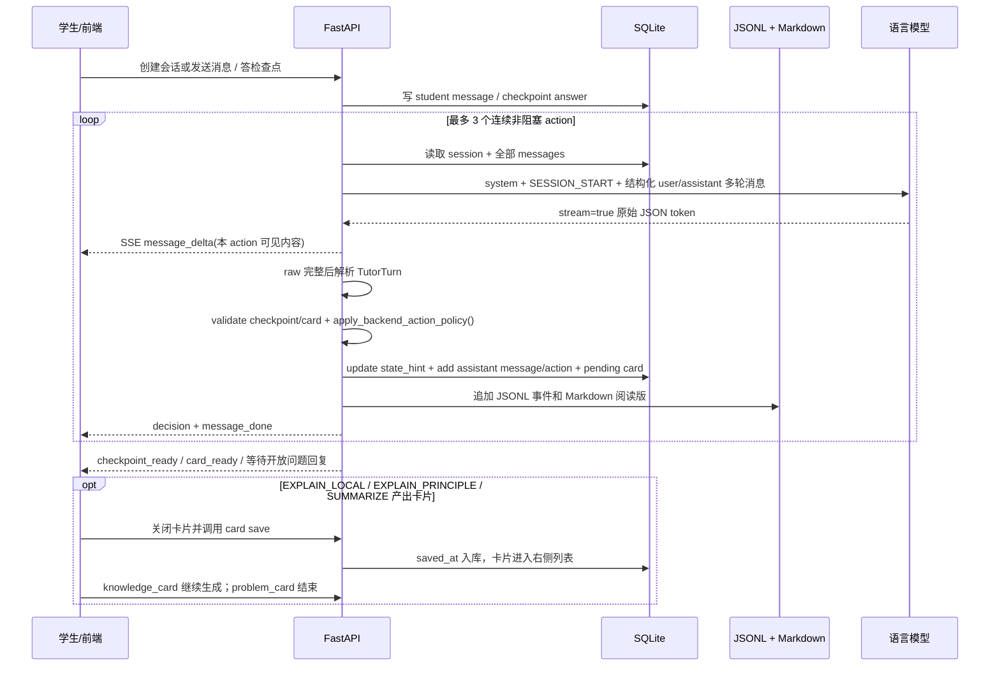

# 答疑状态机与 LLM 主导流程

版本：v1.0
日期：2026-07-15
适用项目：诊断式数学答疑 MVP

本文档说明当前答疑流程的真实运行方式：**后端不写死数学解题分支，但会强制执行教学动作工作流。LLM 每次只输出一个结构化 `TutorTurn` 原子动作；后端根据 action 推导 `wait_for_student`，并在非阻塞动作之间做 bounded loop。`EXPLAIN_PRINCIPLE` 必须产生 `knowledge_card`，`EXPLAIN_LOCAL` 可按知识复用价值选择产生 `knowledge_card`，`SUMMARIZE` 必须产生 `problem_card`。**

如果后续要优化教学策略，优先改：

- `apps/api/app/core/teaching_controller.py` 的 `SYSTEM_PROMPT` 和 `JSON_CONTRACT`
- `apply_backend_action_policy()` 的 action 归一化与等待规则
- `MAX_NONBLOCKING_ACTIONS` 的 bounded loop 上限
- `validate_checkpoint()` 的检查点质量约束
- `build_messages()` 拼给模型的上下文
- `ACTION_PROTOCOL` 的 action 用途、格式和阻塞说明

## 1. 总体闭环



关键点：

- LLM 每轮决定 `state_hint`、`action`、`message`、`breakpoint_description`、`checkpoint`、`knowledge_card`、`problem_card`。
- 后端不信任模型给出的等待判断；`wait_for_student` 由后端根据 action 强制推导。
- `ASK_OPEN_QUESTION` 和 `ASK_MULTIPLE_CHOICE` 是阻塞动作，会停下等待学生。
- `EXPLAIN_LOCAL`、`EXPLAIN_PRINCIPLE`、`RESPOND_TO_CHECKPOINT` 是教学语义上的非阻塞动作。`RESPOND_TO_CHECKPOINT` 直接继续；`EXPLAIN_PRINCIPLE` 必须弹出 `knowledge_card`，`EXPLAIN_LOCAL` 仅在模型判断本次内容值得独立记忆和迁移复用时弹出，关闭归档后继续。
- 连续 3 个非阻塞动作后，下一轮 prompt 会要求模型在“自然总结”和“获取必要的新证据”之间选择；若仍输出非阻塞动作，后端会转成 `ASK_OPEN_QUESTION`。
- `SUMMARIZE` 是终止动作，不等待学生回答，但会弹出 `problem_card`；关闭归档后流程结束。
- `SUMMARIZE` 不要求学生先独立给出最终答案，也不要求额外插入确认性问题；当前结论或卡点已经讲清即可自然收束。
- 项目不主动截断、压缩或摘要历史；模型供应商自身的硬上下文限制仍然存在。

## 2. LLM 输出合同：TutorTurn

每一次 LLM 调用只产出一个教学原子动作：

```json
{
  "state_hint": "diagnosing|scaffolding|explaining|checking|recovering|summarizing",
  "action": "ASK_OPEN_QUESTION|ASK_MULTIPLE_CHOICE|EXPLAIN_LOCAL|EXPLAIN_PRINCIPLE|RESPOND_TO_CHECKPOINT|SUMMARIZE",
  "message": "给学生看的中文内容",
  "breakpoint_description": "当前卡点，可为 null",
  "breakpoint_confidence": 0.0,
  "checkpoint": null,
  "knowledge_card": null,
  "problem_card": null,
  "debug": {}
}
```

动作与结构化字段必须严格匹配：

- `ASK_MULTIPLE_CHOICE`：`checkpoint` 非空，两个 card 字段为 `null`。
- `EXPLAIN_LOCAL`：`knowledge_card` 可空；仅当 message 含值得独立记忆、可迁移的公式、定理、性质或方法辨析时非空，`checkpoint/problem_card` 为 `null`。
- `EXPLAIN_PRINCIPLE`：`knowledge_card` 非空，`checkpoint/problem_card` 为 `null`。
- `SUMMARIZE`：`problem_card` 非空，`checkpoint/knowledge_card` 为 `null`。
- 其余 action：三个结构化附属字段都为 `null`。

代码对应：

- schema：`apps/api/app/core/schemas.py:TutorTurn`
- prompt 合同：`apps/api/app/core/teaching_controller.py:JSON_CONTRACT`
- 解析入口：`extract_json_object()` + `TutorTurn.model_validate()`
- 后端动作策略：`apply_backend_action_policy()`
- 流式生成：`generate_tutor_turn_stream()`

兼容说明：旧模型或旧日志里的 `phase` 仍可被解析为 `state_hint`，但新接口和新日志使用 `state_hint`。

## 3. state_hint 只是状态提示

`state_hint` 不是流程控制器，它的作用是给下一轮 LLM 一个教学状态提示，帮助模型理解当前大概处于诊断、搭脚手架、恢复、总结等阶段。

| state_hint | 语义 |
|---|---|
| `diagnosing` | 诊断卡点 |
| `scaffolding` | 脚手架推进 |
| `explaining` | 局部讲解 |
| `checking` | 检查理解 |
| `recovering` | 错误/不知道后的恢复 |
| `summarizing` | 收尾总结 |

底层 SQLite 目前仍使用 `sessions.phase` 作为兼容存储列；业务接口和 prompt 中把它解释为 `state_hint`。

## 4. action 是真正的教学动作

`action` 现在是工作流控制的核心字段。

system prompt 会在 `ACTION_PROTOCOL` 中逐项告诉模型每个 action 的功能、必需字段、阻塞性和后端行为。action 只是教学控制协议，不是外部 tool call。

| action | 类型 | 后端行为 |
|---|---|---|
| `EXPLAIN_LOCAL` | 非阻塞；可选卡片确认 | 针对学生当前具体卡点；若其中包含可复用的公式、定理、性质或方法辨析，可输出 `knowledge_card` 并在关闭归档后继续 |
| `EXPLAIN_PRINCIPLE` | 非阻塞 + 卡片确认 | 从定义和原理出发讲清一个知识点，输出 `knowledge_card`，关闭归档后继续 |
| `RESPOND_TO_CHECKPOINT` | 非阻塞 | 闭环当前待处理的选择结果，指出理解证据或误区，并提供具体、真诚的情绪支持 |
| `ASK_OPEN_QUESTION` | 阻塞 | 展示开放问题，`wait_for_student=true`，等待学生输入 |
| `ASK_MULTIPLE_CHOICE` | 阻塞 | 要求存在合法 checkpoint，用三个可诊断选项定位学生误区 |
| `SUMMARIZE` | 终止 + 卡片确认 | 自然总结并输出整题上帝视角解法的 `problem_card`，关闭归档后结束 |

后端会做动作归一化：

- 有 `checkpoint` 但 action 不是 `ASK_MULTIPLE_CHOICE`：改成 `ASK_MULTIPLE_CHOICE`。
- `ASK_MULTIPLE_CHOICE` 但没有合法 checkpoint：降级为 `EXPLAIN_LOCAL`。
- 模型输出未知 action：降级为 `EXPLAIN_LOCAL`。
- 强制阻塞轮仍输出非阻塞 action：改成 `ASK_OPEN_QUESTION`，并补一句让学生回答的问题。

## 5. wait_for_student 由后端推导

模型不需要也不应该决定 `wait_for_student`。后端规则固定为：

```text
ASK_OPEN_QUESTION       -> wait_for_student = true
ASK_MULTIPLE_CHOICE     -> wait_for_student = true，前提是 checkpoint 合法
SUMMARIZE               -> wait_for_student = false，终止本轮 stream
EXPLAIN_PRINCIPLE       -> wait_for_student = false，但在 card_ready 后暂停 HTTP stream，等待关闭归档
EXPLAIN_LOCAL           -> wait_for_student = false；若输出 knowledge_card，同样在 card_ready 后暂停
其他非阻塞 action       -> wait_for_student = false，继续 loop
```

这样避免模型把“讲解动作”误标成等待，也避免 `EXPLAIN_LOCAL + checkpoint` 这种旧式混合动作继续扩散。

## 6. bounded loop 如何运行

`POST /api/chat/stream` 不再只调用一次 LLM。它会循环：

```text
读取最新 history
-> 调 LLM 生成一个 TutorTurn
-> 流式展示 message
-> 解析和校验 action/checkpoint
-> 写 assistant message 和 JSONL tutor_turn
-> 发 decision
-> 发 message_done
-> 如果 wait_for_student、SUMMARIZE 或产生 card：停止当前 HTTP stream
-> knowledge_card 关闭归档后，由前端发起无新 student message 的继续生成
-> 否则继续下一轮
```

连续非阻塞动作最多 3 个。第 4 次调用会带上收束提示：

```text
本轮已经连续执行了 3 个非阻塞教学动作；
若当前问题或卡点已经清楚处理，直接选择 SUMMARIZE；
否则选择 ASK_OPEN_QUESTION 或 ASK_MULTIPLE_CHOICE 获取必要的新证据。
```

因此模型可以形成更丰富的教学链路，例如：

```text
RESPOND_TO_CHECKPOINT
-> EXPLAIN_PRINCIPLE
-> SUMMARIZE
```

当现有信息不足以收束时，讲解后仍可进入 `ASK_MULTIPLE_CHOICE` 或 `ASK_OPEN_QUESTION`；确认题不再是每条链路进入总结前的固定关卡。

## 7. 检查点如何反馈给 LLM

学生答检查点仍有“保存答案”和“继续生成”两个请求，但学生结果只入库一次：

1. `POST /api/checkpoints/{id}/answer`
   - 写 `selected_option_id / is_correct / elapsed_ms`
   - `CHECKPOINT_CORRECT -> next_state_hint = scaffolding`
   - `CHECKPOINT_WRONG -> next_state_hint = recovering`
   - `CHECKPOINT_UNKNOWN -> next_state_hint = recovering`
   - 同时直接写 role=`student`、action=`CHECKPOINT_RESPONSE` 的 message
   - metadata 保存结构化 `checkpoint_result`
   - `in_reply_to_action_id` 指向产生检查点的 `ASK_MULTIPLE_CHOICE`

2. 前端立刻再调 `POST /api/chat/stream`
   - 不再重复提交 message
   - 后端从 SQLite 完整 history 中读取刚保存的 `checkpoint_result`

checkpoint 类似一次需要结果的调用，但结果来自学生，而不是电脑工具。下一轮 LLM 同时看到可读的学生选择和结构化的正误、误区、耗时、event 与 next_state_hint。

## 8. knowledge_card 与 problem_card

两类卡片共用 `study_cards` 表，但内容合同不同：

- `knowledge_card`：`title / knowledge_point / core_idea / derivation_steps / when_to_use / common_mistakes / connection_to_problem`。
- `problem_card`：`title / problem_summary / solution_overview / solution_steps / pitfalls / how_to_think / final_answer`。

`EXPLAIN_PRINCIPLE` 必须输出 knowledge card；`EXPLAIN_LOCAL` 由模型判断是否输出。局部讲解中易混且可迁移的辨析（例如韦达定理“和用 $-b/a$、积用 $c/a$”）适合出卡；一次性代入、算术计算、符号改写或纯本题过渡不出卡。可选卡仍必须结构化 message 中的同一个知识点，不得扩大讲解范围。

生成 action、assistant message 和待归档 card 在一个 SQLite 事务中写入。新卡片最初 `saved_at=null`，不会出现在右侧卡片库；前端点大叉后调用 `POST /api/cards/{id}/save`，后端写入 `saved_at`，卡片才进入跨 session 的全局已归档列表。未归档卡片存在时，`/api/chat/stream` 返回 409，避免绕过确认继续生成。

卡片接口：

```text
GET    /api/cards?card_type=knowledge_card|problem_card
POST   /api/cards/{card_id}/save
DELETE /api/cards/{card_id}
```

`session_id` 仍保存在卡片记录中作为来源审计字段，但全局卡片库的查询与删除不依赖当前会话。新建、恢复或删除 session 都不会清空已归档卡片；只有 `saved_at=null` 的待归档卡片仍属于原会话的阻塞工作流。

## 9. SSE 事件顺序

一次 `/api/chat/stream` 可能包含多个 action。每个 action 都会有自己的事件段：

```text
message_delta   × N
decision
checkpoint_ready?  # 仅 ASK_MULTIPLE_CHOICE 且 checkpoint 合法
card_ready?        # EXPLAIN_LOCAL（可选）/ EXPLAIN_PRINCIPLE / SUMMARIZE 且 card 合法
message_done
```

`message_done` 在卡片 action 中额外带 `awaiting_card_dismissal=true`；只要卡片是 `knowledge_card`（来自 `EXPLAIN_LOCAL` 或 `EXPLAIN_PRINCIPLE`），`continue_after_card=true`；`problem_card` 为 false。

`decision` 包含：

```json
{
  "state_hint": "scaffolding",
  "action": "EXPLAIN_LOCAL",
  "wait_for_student": false,
  "message": "本 action 的完整可见内容",
  "breakpoint": "当前卡点",
  "confidence": 0.8,
  "action_index": 0
}
```

前端收到 `message_done` 后会把下一个 action 开成新的 assistant 气泡，避免多个 LLM 调用的文本糊成一段。

## 10. 日志口径

每次 LLM 调用都会同时追加严格 JSONL 和留白充足的 Markdown。JSONL 中每一次调用单独写一条 `tutor_turn`：

- `prompt_messages`
- `raw_response`
- `parsed_turn`
- `latency_ms`
- `parse_ok`
- `used_fallback`
- `error`

所以 bounded loop 中的每个 action 都能单独复盘。检查点答案事件使用 `next_state_hint` 记录后端预置的下一轮状态提示。两种日志都不参与 session 恢复；历史恢复只读 SQLite。

做运行分析时优先看：

1. 每条 `tutor_turn.parsed_turn.action`
2. `wait_for_student`
3. `checkpoint != null`
4. 是否有 `used_fallback`
5. 连续非阻塞动作是否超过预期
6. 检查点答案后的下一轮是否真正响应学生选择

## 11. fallback 与容错

当前后端仍保留几层容错：

- `strip_code_fence()` 去掉 markdown fence。
- `extract_json_object()` 从文本中截取最外层 JSON。
- `repair_unescaped_string_field(text, "message")` 修复 message 内部未转义引号。
- `recover_tutor_turn_from_raw()` 在 JSON 解析失败时恢复最小可用 turn。
- `validate_checkpoint()` 移除不合格 checkpoint。
- `apply_backend_action_policy()` 修正 action/checkpoint/wait 的不一致。

需要注意：fallback 后可能丢失原本 raw 中的 checkpoint，所以分析时不能只看 raw，也要看最终 `parsed_turn.checkpoint`。

## 12. 一句话结论

当前流程已经从“LLM 自选 phase/action/checkpoint 的软状态机”升级为“LLM 产出教学原子动作，后端强制 action 工作流”的结构：`state_hint` 只负责提示，`action` 决定控制流，`wait_for_student` 由后端推导，bounded loop 负责把多个非阻塞讲解动作串起来，直到真正需要学生参与。
