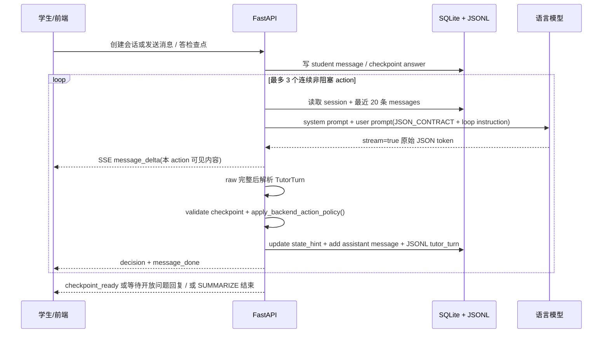

# 答疑状态机与 LLM 主导流程

版本：v0.6
日期：2026-07-08
适用项目：诊断式数学答疑 MVP

本文档说明当前答疑流程的真实运行方式：**后端不写死数学解题分支，但会强制执行教学动作工作流。LLM 每次只输出一个结构化 `TutorTurn` 原子动作；后端根据 action 推导 `wait_for_student`，并在非阻塞动作之间做 bounded loop，直到需要学生回答或完成总结。**

如果后续要优化教学策略，优先改：

- `apps/api/app/core/teaching_controller.py` 的 `SYSTEM_PROMPT` 和 `JSON_CONTRACT`
- `apply_backend_action_policy()` 的 action 归一化与等待规则
- `MAX_NONBLOCKING_ACTIONS` 的 bounded loop 上限
- `validate_checkpoint()` 的检查点质量约束
- `build_messages()` 拼给模型的上下文
- 前端 `handleCheckpoint()` 回传给模型的学生答题表达

## 1. 总体闭环



关键点：

- LLM 每轮决定 `state_hint`、`action`、`message`、`breakpoint_description`、`checkpoint`。
- 后端不信任模型给出的等待判断；`wait_for_student` 由后端根据 action 强制推导。
- `ASK_OPEN_QUESTION` 和 `SHOW_CHECKPOINT_MC` 是阻塞动作，会停下等待学生。
- `DECOMPOSE_STEP`、`EXPLAIN_LOCAL`、`EXPLAIN_PRINCIPLE`、`RESPOND_TO_CHECKPOINT` 是非阻塞动作，后端会继续调用下一轮 LLM。
- 连续 3 个非阻塞动作后，下一轮 prompt 会强制要求阻塞动作；若模型仍输出非阻塞动作，后端会转成 `ASK_OPEN_QUESTION`。
- `SUMMARIZE` 是终止动作，不等待学生。

## 2. LLM 输出合同：TutorTurn

每一次 LLM 调用只产出一个教学原子动作：

```json
{
  "state_hint": "diagnosing|scaffolding|explaining|checking|recovering|summarizing",
  "action": "ASK_OPEN_QUESTION|SHOW_CHECKPOINT_MC|DECOMPOSE_STEP|EXPLAIN_LOCAL|EXPLAIN_PRINCIPLE|RESPOND_TO_CHECKPOINT|SUMMARIZE",
  "message": "给学生看的中文内容",
  "breakpoint_description": "当前卡点，可为 null",
  "breakpoint_confidence": 0.0,
  "checkpoint": null,
  "debug": {}
}
```

代码对应：

- schema：`apps/api/app/core/schemas.py:TutorTurn`
- prompt 合同：`apps/api/app/core/teaching_controller.py:JSON_CONTRACT`
- 解析入口：`extract_json_object()` + `TutorTurn.model_validate()`
- 后端动作策略：`apply_backend_action_policy()`
- 流式生成：`generate_tutor_turn_stream()`

兼容说明：旧模型或旧日志里的 `phase` 仍可被解析为 `state_hint`，但新接口和新日志使用 `state_hint`。

## 3. state_hint 只是状态提示

`state_hint` 不是流程控制器，它的作用是给下一轮 LLM 一个教学状态提示，帮助模型理解当前大概处于诊断、搭脚手架、恢复、总结等阶段。

| state_hint | 语义 |
|---|---|
| `diagnosing` | 诊断卡点 |
| `scaffolding` | 脚手架推进 |
| `explaining` | 局部讲解 |
| `checking` | 检查理解 |
| `recovering` | 错误/不知道后的恢复 |
| `summarizing` | 收尾总结 |

底层 SQLite 目前仍使用 `sessions.phase` 作为兼容存储列；业务接口和 prompt 中把它解释为 `state_hint`。

## 4. action 是真正的教学动作

`action` 现在是工作流控制的核心字段。

| action | 类型 | 后端行为 |
|---|---|---|
| `DECOMPOSE_STEP` | 非阻塞 | 保存并展示本 action，然后继续下一次 LLM 调用 |
| `EXPLAIN_LOCAL` | 非阻塞 | 保存并展示本 action，然后继续下一次 LLM 调用 |
| `EXPLAIN_PRINCIPLE` | 非阻塞 | 保存并展示本 action，然后继续下一次 LLM 调用 |
| `RESPOND_TO_CHECKPOINT` | 非阻塞 | 保存并展示本 action，然后继续下一次 LLM 调用 |
| `ASK_OPEN_QUESTION` | 阻塞 | 展示开放问题，`wait_for_student=true`，等待学生输入 |
| `SHOW_CHECKPOINT_MC` | 阻塞 | 要求存在合法 checkpoint，创建检查点并等待学生选择 |
| `SUMMARIZE` | 终止 | 展示总结，结束本轮 stream |

后端会做动作归一化：

- 有 `checkpoint` 但 action 不是 `SHOW_CHECKPOINT_MC`：改成 `SHOW_CHECKPOINT_MC`。
- `SHOW_CHECKPOINT_MC` 但没有合法 checkpoint：降级为 `EXPLAIN_LOCAL`。
- 模型输出未知 action：降级为 `EXPLAIN_LOCAL`。
- 强制阻塞轮仍输出非阻塞 action：改成 `ASK_OPEN_QUESTION`，并补一句让学生回答的问题。

## 5. wait_for_student 由后端推导

模型不需要也不应该决定 `wait_for_student`。后端规则固定为：

```text
ASK_OPEN_QUESTION       -> wait_for_student = true
SHOW_CHECKPOINT_MC      -> wait_for_student = true，前提是 checkpoint 合法
SUMMARIZE               -> wait_for_student = false，终止本轮 stream
其他非阻塞 action       -> wait_for_student = false，继续 loop
```

这样避免模型把“讲解动作”误标成等待，也避免 `EXPLAIN_LOCAL + checkpoint` 这种旧式混合动作继续扩散。

## 6. bounded loop 如何运行

`POST /api/chat/stream` 不再只调用一次 LLM。它会循环：

```text
读取最新 history
-> 调 LLM 生成一个 TutorTurn
-> 流式展示 message
-> 解析和校验 action/checkpoint
-> 写 assistant message 和 JSONL tutor_turn
-> 发 decision
-> 发 message_done
-> 如果 wait_for_student 或 SUMMARIZE：停止
-> 否则继续下一轮
```

连续非阻塞动作最多 3 个。第 4 次调用会带上强制提示：

```text
本轮已经连续执行了 3 个非阻塞教学动作；
你必须选择 ASK_OPEN_QUESTION 或 SHOW_CHECKPOINT_MC，让学生回答后再继续。
```

因此模型可以形成更丰富的教学链路，例如：

```text
RESPOND_TO_CHECKPOINT
-> EXPLAIN_PRINCIPLE
-> DECOMPOSE_STEP
-> SHOW_CHECKPOINT_MC
-> 等学生
```

而不是每轮都急着生成检查点。

## 7. 检查点如何反馈给 LLM

学生答检查点仍分两步：

1. `POST /api/checkpoints/{id}/answer`
   - 写 `selected_option_id / is_correct / elapsed_ms`
   - `CHECKPOINT_CORRECT -> next_state_hint = scaffolding`
   - `CHECKPOINT_WRONG -> next_state_hint = recovering`
   - `CHECKPOINT_UNKNOWN -> next_state_hint = recovering`

2. 前端立刻再调 `POST /api/chat/stream`
   - message 形如：
     ```text
     我在检查点「{checkpoint.question}」选了：{option.id} {option.text}
     ```
   - 这条消息以普通 `student` role 入库
   - metadata 中附带 `checkpoint_answer`

真正影响 LLM 的不是隐藏状态，而是历史对话里这句自然语言学生反馈。

## 8. SSE 事件顺序

一次 `/api/chat/stream` 可能包含多个 action。每个 action 都会有自己的事件段：

```text
message_delta   × N
decision
checkpoint_ready?  # 仅 SHOW_CHECKPOINT_MC 且 checkpoint 合法
message_done
```

`decision` 包含：

```json
{
  "state_hint": "scaffolding",
  "action": "EXPLAIN_LOCAL",
  "wait_for_student": false,
  "message": "本 action 的完整可见内容",
  "breakpoint": "当前卡点",
  "confidence": 0.8,
  "action_index": 0
}
```

前端收到 `message_done` 后会把下一个 action 开成新的 assistant 气泡，避免多个 LLM 调用的文本糊成一段。

## 9. 日志口径

JSONL 中每一次 LLM 调用都会单独写一条 `tutor_turn`：

- `prompt_messages`
- `raw_response`
- `parsed_turn`
- `latency_ms`
- `parse_ok`
- `used_fallback`
- `error`

所以 bounded loop 中的每个 action 都能单独复盘。检查点答案事件使用 `next_state_hint` 记录后端预置的下一轮状态提示。

做运行分析时优先看：

1. 每条 `tutor_turn.parsed_turn.action`
2. `wait_for_student`
3. `checkpoint != null`
4. 是否有 `used_fallback`
5. 连续非阻塞动作是否超过预期
6. 检查点答案后的下一轮是否真正响应学生选择

## 10. fallback 与容错

当前后端仍保留几层容错：

- `strip_code_fence()` 去掉 markdown fence。
- `extract_json_object()` 从文本中截取最外层 JSON。
- `repair_unescaped_string_field(text, "message")` 修复 message 内部未转义引号。
- `recover_tutor_turn_from_raw()` 在 JSON 解析失败时恢复最小可用 turn。
- `validate_checkpoint()` 移除不合格 checkpoint。
- `apply_backend_action_policy()` 修正 action/checkpoint/wait 的不一致。

需要注意：fallback 后可能丢失原本 raw 中的 checkpoint，所以分析时不能只看 raw，也要看最终 `parsed_turn.checkpoint`。

## 11. 一句话结论

当前流程已经从“LLM 自选 phase/action/checkpoint 的软状态机”升级为“LLM 产出教学原子动作，后端强制 action 工作流”的结构：`state_hint` 只负责提示，`action` 决定控制流，`wait_for_student` 由后端推导，bounded loop 负责把多个非阻塞讲解动作串起来，直到真正需要学生参与。
