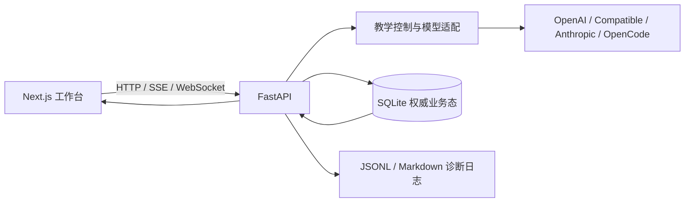

# 系统总览

本文描述 `dev/local` 当前实现的主要逻辑。教学决策细节以 [state-machine.md](./state-machine.md) 为准，持久化与恢复边界以 [context-management.md](./context-management.md) 和 [database.md](./database.md) 为准。

## 1. 产品边界

这是一个 Windows 优先、本地运行的诊断式数学答疑 MVP。它不把模型当作自由聊天机器人，而是要求每轮输出一个结构化 `TutorTurn`，由后端验证后才能写入会话历史。

当前主要输入和产物如下：

| 输入/能力 | 处理结果 |
|---|---|
| 单题或多题文字 | 模型拆题后，一题创建一个独立 session |
| PNG/JPEG/WebP 题图 | 检测并编辑题目框，后端裁剪后批量创建 session |
| 会话内文字、图片或语音转写 | 先可靠接纳，再触发该 session 的下一次生成 |
| 检查点作答 | 原子保存结构化答案，再继续教学 |
| 知识/题目卡片 | 按试卷归档、编辑/移动、导出或形成错题集快照 |

## 2. 组件与数据职责

### Next.js 工作台

- 管理左侧会话/资料导航、中央对话与卡片工作区；桌面侧栏宽度可调整并本地记忆。
- `timeline` reducer 负责消息、checkpoint、卡片和当前 run 的展示状态。
- `session-workflow` 约束互斥交互；`stream-controller` 按 session 隔离活动流和取消原因。
- `lib/api/contracts.ts` 集中校验 HTTP JSON、chat SSE 与语音 WebSocket 返回；TypeScript 类型不能替代边界处的运行时 schema，畸形响应会以带合同名称和字段路径的 `ApiContractError` 失败。
- 切换当前视图不取消其他 session 的生成；页面卸载才统一收束本地连接。
- 恢复用请求、活动 session、输入草稿和题图批处理草稿各自使用稳定标识，避免刷新后重复提交。

### FastAPI

- 路由层只处理 HTTP/SSE/WebSocket 合同和错误映射。
- `services/` 实现输入接纳、checkpoint、卡片关闭、批量建会话和 stream 协调。
- `core/` 构造模型上下文、执行 bounded loop、解析并验证 `TutorTurn`。
- `storage/` 负责 SQLite 事务、run、durable events、卡片/试卷/错题集和诊断日志。
- 启动时执行 Alembic `upgrade head`，并终结旧进程遗留的 `queued/running` run。

### SQLite 与日志

SQLite 是 session 恢复的唯一权威来源。关键表按职责分为：

- 会话与对话：`sessions`、`messages`、`checkpoints`。
- 可靠输入与生成：`session_inputs`、`session_runs`、`session_events`。
- 学习资料：`exam_papers`、`card_folders`、`study_cards`、`mistake_sets`、`mistake_set_items`。
- 模型配置：加密保存 provider 配置和 API key；会话固定绑定选定模型。

`logs/sessions/*.jsonl` 和 `*.log.md` 是只追加诊断日志，包含 prompt、原始模型响应和解析信息，但不能用于恢复业务状态。

## 3. 从输入到教学 action

### 3.1 文字与题图建会话

文字首发先调用 `POST /api/problem-intake/analyze-text`。模型只负责返回自包含的 `problems[]`；`POST /api/sessions/batch-start` 再在一个事务中为每题创建 session、接纳首条学生消息并写入 `STUDENT_RESPONSE`。

新题图先调用 `POST /api/problem-images/detect` 获得最多 20 个归一化框。用户可以新增、删除、移动和缩放框；确认试卷归属后，`POST /api/sessions/image-batch-start` 在后端裁剪原图并批量创建 session。浏览器在 IndexedDB 保存检测阶段、框、原图 Blob、`paper_id` 和稳定幂等 ID，刷新后可以继续。

拆题阶段只决定创建几个 session，不参与正式教学 action。进入 session 后，题目和学生思路仍由完整对话语义更新。

### 3.2 可靠输入接纳

普通学生消息先进入 `POST /api/sessions/{session_id}/inputs`：

1. 客户端生成稳定 `client_message_id`。
2. 服务端在同一 SQLite 事务中写入 `session_inputs` 和 `STUDENT_RESPONSE` message。
3. 同 ID、同内容重试返回首次结果；同 ID、不同内容返回 `409 IDEMPOTENCY_KEY_CONFLICT`。
4. 接纳成功后，客户端才调用 `POST /api/chat/stream` 启动生成。

Checkpoint 答案和卡片保存/舍弃继续命令也先走各自的原子接纳服务。Checkpoint 由数据库唯一约束保证只成功回答一次；前端随后只触发继续生成，不重复提交答案文本。

### 3.3 Run 与模型调用

每个生成意图带稳定 `client_run_id`，`session_id + client_run_id` 唯一。`session_runs` 记录 `queued → running → completed`，失败或中断进入 `failed / interrupted`：

- 同一 session 的 run 串行，不同 session 可以并行。
- 显式停止调用 `/api/sessions/{session_id}/interrupt`，同时取消 provider 请求、退避和后续 loop。
- 浏览器断流不等于显式中断；服务端记录 `failed/client_disconnected`。
- 进程重启不会自动重放 provider 工作，而是把遗留 run 标为 `failed/process_restarted`。
- 瞬时网络/限流/5xx 故障在有界预算内退避重试；结构化 JSON 也有独立的有界纠正重试。

### 3.4 TutorTurn 校验与提交

模型只能选择以下 action：

- `ASK_OPEN_QUESTION`
- `ASK_MULTIPLE_CHOICE`
- `EXPLAIN_LOCAL`
- `EXPLAIN_PRINCIPLE`
- `RESPOND_TO_CHECKPOINT`
- `SUMMARIZE`

`context_status=need_problem|need_thought` 时，后端把教学限制为 `ASK_OPEN_QUESTION`；两项信息明确后进入 `ready`。`wait_for_student` 不接受模型输入，而是由后端推导：两个提问 action 为 `true`，讲解、反馈和总结为 `false`。

一个 action 只有在 JSON 完整解析、策略校验通过并完成 SQLite 事务后才进入历史。该事务同时写入 assistant message、可选 checkpoint/卡片、run 的 action 下标以及 `message.completed`、`action.completed` 等 durable events。流式显示到一半的内容不会形成半条历史消息。

## 4. 教学闭环

`EXPLAIN_LOCAL` 只修一个具体步骤；`EXPLAIN_PRINCIPLE` 只讲一个可迁移原理。讲解后若学生尚未应用，下一步优先通过诊断选择题获取新证据，不能用连续讲解自动完成整题。

后端 bounded loop 最多连续执行有限个非阻塞 action；达到上限时必须转为提问或总结。`SUMMARIZE` 只有在当前目标确已处理时使用，并生成保存完整题目条件、步骤和答案的 `problem_card`。

知识卡片与题目卡片职责分离：

- `EXPLAIN_PRINCIPLE` 必须产生知识卡；`EXPLAIN_LOCAL` 在含可迁移知识时产生知识卡。
- 题目卡只由 `SUMMARIZE` 产生。
- 数学表达必须位于 `$...$` 或 `$$...$$` 中，保证 KaTeX 与 PDF 排版一致。
- 卡片先作为待处理副作用锚定在来源 assistant 消息后；保存后进入全局卡片库，舍弃则原子记录控制输入并删除待归档卡片。

## 5. 事件、快照与恢复

Chat SSE 和 durable event SSE 承担不同职责：

- `message_delta/message_reset` 是当前连接的瞬时显示事件，没有 durable `seq`，不能重放。
- `session_events` 只记录与业务写入同事务提交的稳定边界，并按 session 提供严格递增 `seq`。
- 断线重连先用 SQLite session 快照恢复完整状态，再从最后确认的 `seq` 补 durable events。
- Chat SSE 只有在完整 action 和 run 完成状态提交后才发送 `stream_complete`；干净 EOF 本身不代表成功。

前端用事件携带的 session id 和本地 run id 防止后台流污染后来打开的会话。重新打开仍在生成的 session 时，页面先显示 SQLite 已提交内容，再接回该 session 的活动流。

## 6. 学习资料与删除语义

知识卡片、题目卡片和错题集是独立资料层：

- 两类卡片共享层级目录；有试卷归属的卡片进入受管试卷目录。
- 知识卡可编辑，题目卡内容只读但可移动归档位置。
- 错题集按有序 `card_ids` 保存独立快照，来源 session 后续删除也不影响快照。
- 删除 session 不删除已归档卡片；删除卡片不删除来源 session。
- 清空会话与清空卡片是两个需要确认的独立操作，生成活跃时受权威 run 状态保护。

## 7. 模型与多模态

模型 profile 在后端加密保存，并按 provider 类型使用固定协议：OpenAI Responses、OpenAI-compatible Chat Completions 或 Anthropic Messages。OpenAI Responses 可保存响应 ID 续接推理；上游不接受旧 ID 时回退到完整历史。

连接测试会使用当前 timeout、temperature、max output tokens 和推理强度。图片能力通过随机视觉挑战探测，而不是只判断接口是否返回文字。含题图的 session 必须绑定多模态模型，并保留原始 `problem_image_data_url` 供后续每轮调用。

## 8. 代码入口

| 关注点 | 主要入口 |
|---|---|
| 应用与路由 | `apps/api/app/main.py`、`apps/api/app/routes/` |
| 教学 prompt/loop | `apps/api/app/core/teaching_controller.py` |
| TutorTurn 校验 | `apps/api/app/core/tutor_turn_parsing.py`、`tutor_turn_policy.py` |
| 输入和 run 协调 | `apps/api/app/services/`、`apps/api/app/storage/session_run_repository.py` |
| SQLite 与迁移 | `apps/api/app/storage/`、`apps/api/migrations/versions/` |
| 前端工作台 | `apps/web/app/page.tsx`、`apps/web/components/workspace/` |
| 前端恢复与流 | `apps/web/hooks/useSessionRuntime.ts`、`apps/web/lib/timeline.ts`、`stream-controller.ts` |

运行、验证和排障命令见 [how-to-run.md](./how-to-run.md)，全部文档入口见 [docs/README.md](./README.md)。
