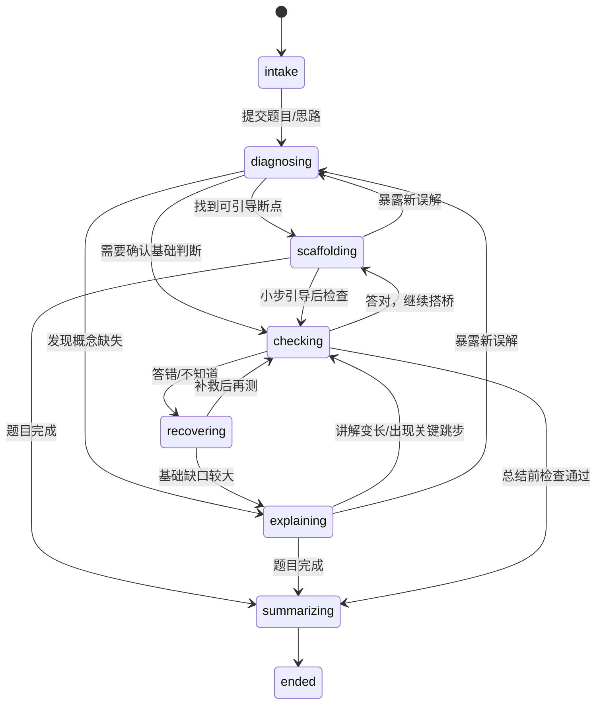
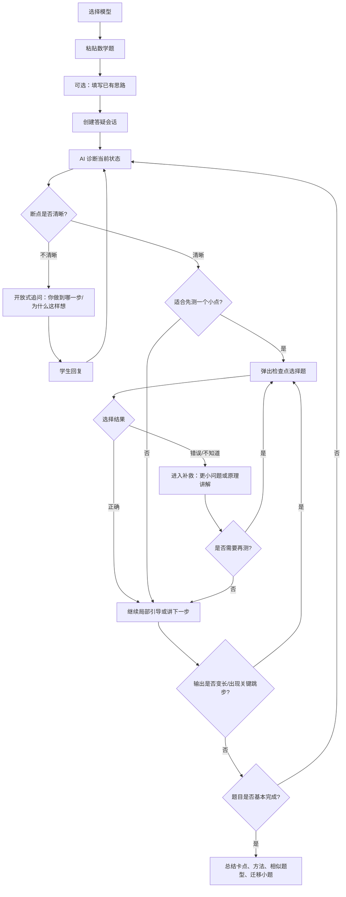
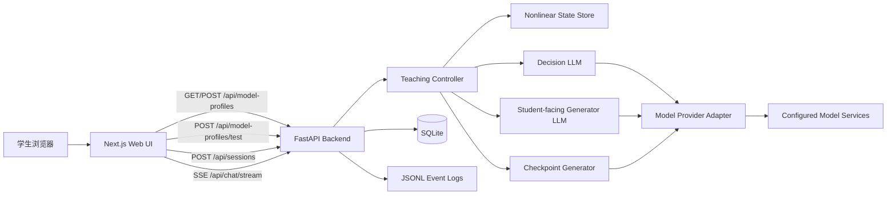

# 诊断式数学答疑 MVP 开发前文档

版本：v0.2  
日期：2026-07-07  
目标读者：产品、算法、前端、后端、参与测试的教研/运营同学  

## 0. v0.2 变更摘要

相对 v0.1，本版做了 5 个关键调整：

1. 教学流程不再描述为线性状态机，而是“非线性教学状态 + 事件驱动策略”。检查点提问可以在讲解过程中随时插入。
2. 提问功能统一设计为“AI 生成选择题弹窗”：3 个选项中 1 个正确、2 个错误，另有“我不知道”。
3. MVP 聚焦初高中数学，支持文本输入和题目图片识别，不做多学科覆盖。
4. MVP 内部不再开发传统讲题 baseline。对照产品直接使用豆包爱学、元宝拍题答疑等外部现有产品。
5. 增加模型配置与模型选择逻辑：系统可配置多个模型服务，每次进入答疑前用户必须选择本次使用的模型。

## 1. 一句话定义

做一个面向中国初中、高中学生的“诊断式数学答疑”小 demo：学生复制粘贴数学题或上传题目图片，并描述自己已经想到哪一步；AI 先诊断学生真实卡点，再从卡点附近用小问题、局部讲解、检查点选择题和总结帮助学生继续往下推。

核心目标不是完整覆盖所有题型，而是验证：

> 对于“学生已经会一部分但卡住”的数学题，诊断式答疑是否比直接从头讲题更能命中卡点、维持参与感、帮助学生完成后续步骤。

## 2. MVP 范围

### 2.1 本版只做什么

学科范围：

1. 初中数学。
2. 高中数学。

输入范围：

1. 支持文本输入，也支持上传 PNG、JPEG、WebP 题目图片。
2. 图片识别模型提取题目文字、必要题图以及可识别的学生过程/答案/批改信息。
3. 学生可选填“我已经想到哪一步 / 卡在哪里”。
4. 含必要题图的题目必须选择多模态模型答疑，并在每轮答疑请求中携带用户原图。
5. 不承诺识别所有手写公式和批改痕迹；无法提取时对应字段留空。

题型范围建议：

1. 初中：方程与不等式、一次函数、二次函数、几何基础证明、相似三角形、圆的基础题。
2. 高中：函数性质、三角函数、数列、解析几何基础、导数基础、概率统计基础。

交互范围：

1. 只做诊断式答疑。
2. AI 可以提开放式追问，也可以弹出选择题检查点。
3. 检查点弹窗必须由 AI 生成 3 个选项，另加固定选项“我不知道”。
4. 答疑结束后生成总结和一道可选的迁移小题。

### 2.2 本版明确不做什么

1. 不做题库式拍照搜题，只做当前上传图片的识别与答疑。
2. 不做多张图片拼接和批量题目录入。
3. 不做语音。
4. 不做复杂账号系统。
5. 不做家长端、教师端。
6. 不做内置传统讲题模式。
7. 不做大规模题库。
8. 不做长期学习路径。
9. 不做所有学科，只做数学。

### 2.3 外部对照方式

MVP 不在系统内实现传统讲题 baseline。验证时直接让测试学生使用外部现有产品作为对照，例如：

1. 豆包爱学。
2. 元宝拍题答疑。
3. 其他常见从头讲题类产品。

记录方式：

1. 同一批学生使用本 MVP 和外部产品分别完成相近难度题目。
2. 外部产品结果由人工记录：完成时间、学生主观评分、是否讲到卡点、是否能完成后续步骤。
3. 本 MVP 自动记录详细过程数据。

这样可以减少 MVP 开发量，把精力集中在诊断式答疑本身。

## 3. 产品假设与验证指标

### 3.1 产品假设

很多学生不是“整道题完全不会”，而是：

1. 题目读懂了，但不知道下一步建模。
2. 公式知道，但不知道为什么这里能用。
3. 推到一半卡在某个代数变形。
4. 会套步骤，但不知道某一步的依据。
5. 看完整答案能点头，但换一道相似题仍然不会。

本产品假设：

> 先诊断学生当前思路，再从断点附近开始引导，比直接完整讲解更适合这类学生。

### 3.2 效果指标

核心指标：

1. 卡点命中感：学生是否觉得“AI 讲到了我真正卡住的地方”，1-5 分。
2. 断点命中率：人工复核 AI 判断的卡点是否合理，目标 >= 70%。
3. 继续解题成功率：学生在答疑后能否完成原题后续关键步骤。
4. 检查点正确率：学生在弹窗选择题中的答对率，以及从答错到答对的变化。
5. 迁移题表现：答疑结束后，学生能否完成一道同类极简题的关键步骤。

辅助指标：

1. 学生是否觉得“被追问得烦”。
2. AI 是否讲了过多学生已经会的内容。
3. 单题总答疑轮数。
4. 学生选择“我不知道”的频率。
5. 学生中途放弃率。

### 3.3 实时性指标

1. 首 token 时间 TTFT：P50 <= 2.5 秒，P95 <= 6 秒。
2. 首个诊断问题生成完成时间：P50 <= 5 秒，P95 <= 10 秒。
3. 检查点弹窗生成时间：P50 <= 6 秒，P95 <= 12 秒。
4. 普通一轮答疑完整响应时间：P50 <= 12 秒，P95 <= 25 秒。
5. 每轮记录模型名、provider、决策耗时、生成耗时、总耗时。

## 4. 核心产品判断：不是线性流程，而是非线性教学控制

### 4.1 v0.1 的问题

v0.1 中的流程图容易让人误解为：

1. 先诊断。
2. 再微问题。
3. 再知识讲解。
4. 再检查点。
5. 最后总结。

如果系统只能按这个顺序走一遍，就不合理。真实教学不是线性管道。

例如：

1. 讲解过程中只要内容稍微变多，就应该随时插入检查点。
2. 学生答错检查点后，可能回到更基础的概念。
3. 学生答对检查点后，可以继续原来的推导。
4. 学生突然暴露新误解时，应该重新诊断当前断点。
5. 总结前也可以再问一个迁移小问题。

### 4.2 v0.2 的设计

本 MVP 采用：

> 非线性教学状态 + 事件驱动策略 + 受控动作集合

它不是“只能一步步往前走”的线性状态机，而是一个有当前上下文的教学控制器。

系统在每一轮都会根据事件重新决策：

1. 学生新输入了一段思路。
2. 学生回答了一个检查点选择题。
3. AI 刚讲完一段较长内容。
4. 学生说没懂。
5. 学生选择“我不知道”。
6. 已经接近解题完成。
7. 当前讲解长度超过阈值。

这些事件都可能触发新的动作。

### 4.3 教学状态不是路线，而是上下文标签

状态只表示“当前教学上下文”，不是固定路线。

```ts
type TeachingPhase =
  | "intake"        // 收集题目和学生初始思路
  | "diagnosing"    // 判断当前卡点
  | "scaffolding"   // 用小问题搭桥
  | "explaining"    // 局部讲解或原理讲解
  | "checking"      // 检查点选择题
  | "recovering"    // 学生答错/不知道后的补救
  | "summarizing"   // 总结与迁移
  | "ended";
```

任意阶段都可以根据事件切到 `checking`。例如：

1. `explaining -> checking`
2. `scaffolding -> checking`
3. `recovering -> checking`
4. `summarizing -> checking`

### 4.4 教学动作集合

```ts
type PedagogicalAction =
  | "ASK_OPEN_QUESTION"
  | "SHOW_CHECKPOINT_MC";      // multiple choice
  | "DECOMPOSE_STEP"
  | "EXPLAIN_LOCAL"
  | "EXPLAIN_PRINCIPLE"
  | "RESPOND_TO_CHECKPOINT"
  | "SUMMARIZE";
```

动作说明：

| 动作 | 用途 | 是否等待学生 |
|---|---|---:|
| `ASK_OPEN_QUESTION` | 开放式追问学生思路或卡点 | 是 |
| `SHOW_CHECKPOINT_MC` | 弹窗选择题，检查是否跟上 | 是 |
| `DECOMPOSE_STEP` | 把当前断点拆成更小的一步 | 可能 |
| `EXPLAIN_LOCAL` | 只解释当前题目里的一个跳步 | 否 |
| `EXPLAIN_PRINCIPLE` | 从原理讲明白一个基础概念 | 否 |
| `RESPOND_TO_CHECKPOINT` | 根据学生选择反馈对错并补救 | 否/可能 |
| `SUMMARIZE` | 总结卡点、方法和迁移题 | 是 |

## 5. 事件驱动教学策略

### 5.1 关键事件

```ts
type TeachingEvent =
  | "PROBLEM_SUBMITTED"
  | "STUDENT_THOUGHT_SUBMITTED"
  | "OPEN_QUESTION_ANSWERED"
  | "CHECKPOINT_CORRECT"
  | "CHECKPOINT_WRONG"
  | "CHECKPOINT_UNKNOWN"
  | "EXPLANATION_TOO_LONG"
  | "NEW_MISCONCEPTION_DETECTED"
  | "READY_TO_SUMMARIZE";
```

### 5.2 检查点随时插入规则

检查点不是固定流程末尾的步骤，而是随时可触发的教学动作。

建议触发条件：

1. AI 连续输出超过 160 字，且没有让学生参与。
2. AI 完成了一个关键推理跳步。
3. AI 引入了一个新概念、公式或性质。
4. AI 从断点进入下一步推导前。
5. 学生此前连续 2 次表示没懂或选错。
6. 准备总结前，需要确认学生是否抓住关键桥梁。

强制限制：

1. 检查点问题不能是“你听懂了吗”“你跟上了吗”。
2. 检查点必须和当前题目的数学对象、计算步骤或概念判断直接相关。
3. 每个检查点只测一个小点。
4. 每次最多一个弹窗。
5. 如果连续两个检查点答错，要进入 `recovering`，降低难度或讲原理。

### 5.3 非线性流转示意



## 6. 检查点选择题弹窗设计

### 6.1 产品形态

当 AI 需要检测学生是否跟上时，不在聊天里只问一句“懂了吗”，而是在界面中弹出一个小选择题。

弹窗内容：

1. 一个由 AI 生成的问题。
2. 三个由 AI 生成的答案选项。
3. 三个答案中必须有且只有一个正确答案。
4. 两个错误答案要对应常见误解，而不是随便乱写。
5. 固定第四个选项：“我不知道”。

用户点击后：

1. 弹窗关闭。
2. 选择结果进入聊天上下文。
3. 后端记录选项、正确性、耗时。
4. AI 根据结果继续教学。

### 6.2 弹窗交互规则

1. 弹窗出现时，聊天输入框暂时禁用，避免学生跳过检查。
2. 学生可以选择“我不知道”，这不是失败，而是明确诊断信号。
3. 选错后不直接给完整答案，应先指出误区，再换更小的问题或讲原理。
4. 选对后给一句确认，然后继续下一步，不要奖励式废话过多。
5. 弹窗问题应在 15-40 字内，选项应在 5-25 字内。

### 6.3 检查点 JSON 结构

```json
{
  "type": "checkpoint_mc",
  "question": "如果 y = -2(x-3)^2 + 5，要让 y 最大，平方项应该取什么值？",
  "options": [
    {
      "id": "A",
      "text": "取 0",
      "is_correct": true,
      "misconception": null
    },
    {
      "id": "B",
      "text": "取最大值",
      "is_correct": false,
      "misconception": "忽略了平方项前面是负数"
    },
    {
      "id": "C",
      "text": "取 -3",
      "is_correct": false,
      "misconception": "把 x 的值和平方项的值混淆"
    }
  ],
  "unknown_option": {
    "id": "UNKNOWN",
    "text": "我不知道"
  },
  "tested_point": "二次函数顶点式中平方项取最小值时整体最大",
  "difficulty": "easy"
}
```

### 6.4 检查点生成约束

后端要求 LLM 返回结构化 JSON，并校验：

1. `options.length === 3`
2. `is_correct === true` 的选项恰好 1 个
3. 每个错误选项必须有 `misconception`
4. `question` 不能为空
5. `tested_point` 不能为空
6. 不允许问题文本是“是否理解”“是否听懂”“能跟上吗”这类元认知问题

如果校验失败：

1. 后端重试一次。
2. 仍失败则降级为开放式小问题。
3. 记录 `checkpoint_generation_failed`。

## 7. 诊断式答疑主流程

### 7.1 开始前：必须选择模型

用户每次进入答疑前必须选择本次使用的模型。

开始页包含：

1. 年级：初中 / 高中。
2. 数学题目文本。
3. 学生当前思路，可选。
4. 模型选择器，必选。
5. “添加模型配置”按钮，用于输入模型 URL、API key、model name 并保存到本机后端。

如果未选择模型：

1. “开始答疑”按钮禁用。
2. 前端提示“请选择本次答疑使用的模型；如果还没有可用模型，请先添加模型配置”。
3. 后端也要校验 `model_profile_id`，不能只依赖前端。

### 7.2 主流程



注意：这张图只是常见路径，不是唯一固定路线。系统可以在讲解、补救、总结前随时触发检查点。

## 8. 教学动作细节

### 8.1 开放式追问 `ASK_OPEN_QUESTION`

用途：

1. 学生只发题，没有说自己怎么想。
2. 学生说“不会”，但没有暴露具体卡点。
3. AI 对断点置信度不足。

要求：

1. 只问 1 个主问题。
2. 问题必须和当前题目相关。
3. 避免泛泛地问“哪里不会”。

示例：

> 你已经把式子化到这里了吗？如果有的话，把你现在得到的式子发我；如果还没化到这里，我们先看为什么要把它整理成顶点式。

### 8.2 检查点选择题 `SHOW_CHECKPOINT_MC`

用途：

1. AI 刚讲了一个关键数学跳步。
2. AI 要判断学生是否理解当前概念。
3. 学生刚经历一次补救讲解。
4. 总结前确认学生是否掌握关键桥梁。

示例：

题目：

> 要让 `-2(x-3)^2 + 5` 最大，关键是让哪一部分尽可能小？

选项：

1. `(x-3)^2`
2. `-2`
3. `+5`
4. 我不知道

### 8.3 拆解步骤 `DECOMPOSE_STEP`

用途：

1. 断点清晰，但还不需要完整知识讲解。
2. 学生差一个小桥梁就能继续。
3. 复杂问题需要拆成局部可回答的小步。

要求：

1. 只拆当前断点。
2. 不要一次拆完整题。
3. 最好拆成一个可被检查点选择题验证的小概念。

### 8.4 局部讲解 `EXPLAIN_LOCAL`

用途：

1. 学生知道概念，但不会用在当前题。
2. 某一步代数变形或逻辑连接需要解释。

要求：

1. 只讲当前题中的一个跳步。
2. 尽量 80-180 字。
3. 讲完一个跳步后考虑触发检查点。

### 8.5 原理讲解 `EXPLAIN_PRINCIPLE`

用途：

1. 学生连续选错检查点。
2. 学生选择“我不知道”。
3. 学生暴露出基础概念缺失。

结构：

1. 先指出当前卡点。
2. 从数学原理解释。
3. 回到题目中的具体位置。
4. 生成一个检查点选择题。

### 8.6 检查点反馈 `RESPOND_TO_CHECKPOINT`

选择正确：

1. 简短确认。
2. 说明为什么正确。
3. 继续下一步。

选择错误：

1. 不说“错了，你不懂”。
2. 指出这个选项对应的误区。
3. 降低一层难度或讲清原理。

选择“我不知道”：

1. 不视为失败。
2. 直接进入更基础解释。
3. 解释后再给一个更容易的检查点。

## 9. 前端界面设计

### 9.1 页面结构

首屏就是可用的答疑界面，不做营销首页。

布局：

1. 顶部：模型选择器、年级选择器。
2. 左侧：题目输入和学生思路输入。
3. 中间：聊天区域。
4. 右侧：调试面板，显示当前模型、阶段、断点、检查点结果、延迟。

移动端可改为：

1. 顶部固定模型和年级。
2. 主体为聊天区。
3. 题目输入通过抽屉打开。
4. 调试面板隐藏。

### 9.2 模型选择器

要求：

1. 每次新建答疑前必须选择模型。
2. 选择器显示模型名称、供应商、用途标签。
3. 可显示简单状态：可用 / key 已保存 / 暂不可用 / 连通性测试失败。
4. 如果只有一个模型，也仍然显示并要求用户确认。
5. 会话创建后，本次会话模型锁定，不在中途随意切换。
6. 选择器旁边提供“添加模型配置”按钮。

显示示例：

```txt
选择本次答疑模型
[ OpenAI Primary - OpenAI - 高质量 ]
[ Doubao Pro - 火山 - 国内低延迟 ]
[ Qwen Max - 阿里云 - 备用 ]
+ 添加模型配置
```

添加模型配置弹窗字段：

1. 显示名称，例如“我的豆包模型”。
2. 供应商类型：OpenAI-compatible / OpenAI / 其他预设。
3. Base URL。
4. API key。
5. Model name。
6. 用途标签，可选。
7. “测试连接”按钮。
8. “保存并选择”按钮。

保存规则：

1. API key 只在新增或替换时输入一次。
2. 保存后前端不再展示明文 key，只显示类似 `sk-...abcd` 的掩码。
3. 前端不把 key 存到 localStorage、sessionStorage 或浏览器 IndexedDB。
4. 前端把配置提交给后端，由后端写入本地 SQLite，并加密保存 key。
5. 删除模型配置时，需要确认；已存在的历史 session 仍保留当时使用的 `model_profile_id` 记录。

### 9.3 检查点弹窗

弹窗包含：

1. 当前小问题。
2. A/B/C 三个 AI 生成选项。
3. 固定“我不知道”选项。
4. 提交后不可反复修改。

建议 UI：

1. 选项用单选卡片。
2. 正确/错误反馈不要在弹窗中立即强烈标红，避免挫败感。
3. 点击后回到聊天，由 AI 用自然语言解释。

### 9.4 调试面板

内部测试时显示：

1. `session_id`
2. `model_profile_id`
3. 当前 `phase`
4. 当前 `action`
5. 当前断点
6. 断点置信度
7. 最近一次检查点正确答案
8. 学生选择
9. 延迟指标
10. token 使用量

正式学生测试时，可通过环境变量关闭调试面板。

## 10. 后端架构



### 10.1 推荐技术栈

| 层 | 选择 | 原因 |
|---|---|---|
| 前端语言 | TypeScript | 聊天状态、弹窗、事件流需要类型约束 |
| 前端框架 | Next.js App Router + React | 快速搭建 demo、路由和 API 代理 |
| UI | Tailwind CSS + shadcn/ui 或 Radix UI | 适合快速做干净的交互界面 |
| 后端语言 | Python 3.12+ | LLM 编排、评估脚本、日志分析方便 |
| 后端框架 | FastAPI | async、SSE、接口文档友好 |
| 流式传输 | SSE | 当前主要是服务端向前端流式输出 |
| 数据存储 | SQLite + SQLModel/SQLAlchemy | MVP 足够，方便导出 |
| 日志 | JSONL | 方便人工复盘和脚本分析 |
| 测试 | Pytest + Playwright | 后端测策略，前端测关键流程 |

### 10.2 目录建议

```txt
apps/
  web/
    app/
      page.tsx
      session/[id]/page.tsx
      admin/evals/page.tsx
    components/
      ModelSelector.tsx
      ModelConfigDialog.tsx
      ProblemInput.tsx
      ChatPanel.tsx
      CheckpointModal.tsx
      DebugPanel.tsx
  api/
    app/
      main.py
      routes/
        model_profiles.py
        sessions.py
        chat.py
        evals.py
      core/
        teaching_controller.py
        state_store.py
        policies.py
        schemas.py
        prompt_templates.py
      llm/
        provider_base.py
        openai_compatible_provider.py
        model_registry.py
      storage/
        db.py
        models.py
        event_log.py
      tests/
        test_teaching_controller.py
        test_checkpoint_policy.py
        test_model_selection.py
config/
  model-profiles.example.json  # 可选预设，不保存真实 key
data/
  app.db                       # 本地 SQLite，保存用户新增模型配置和会话数据
  app-secret.key               # 本地加密密钥，加入 .gitignore
docs/
  ai-model-config-v0.2.md
```

## 11. API 草案

### 11.1 获取可用模型

```http
GET /api/model-profiles
```

响应：

```json
{
  "profiles": [
    {
      "id": "openai_primary",
      "display_name": "OpenAI Primary",
      "provider": "openai",
      "tags": ["高质量", "数学推理"],
      "status": "available",
      "key_state": "saved",
      "masked_api_key": "sk-...abcd"
    },
    {
      "id": "doubao_math_fast",
      "display_name": "Doubao Math Fast",
      "provider": "openai_compatible",
      "tags": ["国内低延迟"],
      "status": "available",
      "key_state": "saved",
      "masked_api_key": "****...9x2k"
    }
  ],
  "require_user_selection": true
}
```

注意：后端不能向前端返回完整 API key。

### 11.2 添加模型配置

```http
POST /api/model-profiles
```

请求：

```json
{
  "display_name": "我的豆包模型",
  "provider": "openai_compatible",
  "base_url": "https://ark.cn-beijing.volces.com/api/v3",
  "api_key": "user-pasted-api-key",
  "model": "provider-model-name",
  "tags": ["国内低延迟", "测试模型"],
  "timeout_ms": 30000,
  "temperature": 0.2,
  "max_output_tokens": 8000,
  "is_multimodal": false
}
```

响应：

```json
{
  "id": "prof_01hxyz",
  "display_name": "我的豆包模型",
  "provider": "openai_compatible",
  "status": "available",
  "masked_api_key": "****...abcd"
}
```

后端处理：

1. 校验 `base_url`、`api_key`、`model` 非空。
2. 规范化 `base_url`，去掉末尾多余 `/`。
3. 将 API key 加密后保存到 SQLite。
4. 响应中只返回掩码，不返回明文 key。

### 11.3 测试模型连接

```http
POST /api/model-profiles/test
```

请求：

```json
{
  "provider": "openai_compatible",
  "base_url": "https://example-provider.com/v1",
  "api_key": "user-pasted-api-key",
  "model": "provider-model-name"
}
```

响应：

```json
{
  "ok": true,
  "latency_ms": 1280,
  "message": "连接成功"
}
```

测试连接只做最小请求，收到第一个非空可见文本 chunk 即成功并关闭流；`latency_ms` 表示首字延迟（TTFT），避免被回答长度影响。

### 11.4 创建答疑会话

```http
POST /api/sessions
```

请求：

```json
{
  "grade_band": "junior",
  "subject": "math",
  "model_profile_id": "openai_primary",
  "problem_text": "已知 y = -2(x-3)^2 + 5，求 y 的最大值。",
  "student_initial_thought": "我知道要看平方，但不知道最大值为什么是 5。",
  "problem_image_data_url": null
}
```

响应：

```json
{
  "session_id": "sess_123",
  "phase": "diagnosing",
  "model_profile_id": "openai_primary"
}
```

后端校验：

1. `subject` 必须是 `math`。
2. `problem_text` 不能为空。
3. `model_profile_id` 必须存在且可用。
4. 不允许创建没有模型的 session。
5. `problem_image_data_url` 非空表示题目必须查看原图，此时答疑模型必须标记为多模态。
6. 含题图的会话会在每轮答疑调用中把用户原图作为 `image_url` 内容块发送给模型。

### 11.5 聊天流式接口

```http
POST /api/chat/stream
Accept: text/event-stream
```

SSE 事件：

```txt
decision              # 当前教学动作
message_delta         # 学生可见文本增量
checkpoint_ready      # 前端弹出选择题
message_done          # 当前 assistant turn 结束
state_update          # 阶段、断点、置信度更新
metric                # 延迟和 token
error                 # 错误
```

### 11.6 提交检查点答案

```http
POST /api/checkpoints/{checkpoint_id}/answer
```

请求：

```json
{
  "session_id": "sess_123",
  "selected_option_id": "B",
  "elapsed_ms": 6400
}
```

响应：

```json
{
  "is_correct": false,
  "event": "CHECKPOINT_WRONG",
  "next_phase": "recovering"
}
```

## 12. 模型配置设计

详细配置文档见：

[ai-model-config-v0.2.md](C:/Users/robbinpanda/Desktop/ai4edu/产品验证/docs/ai-model-config-v0.2.md)

### 12.1 配置目标

系统要支持多个 AI 模型服务，并让测试人员在每次答疑前明确选择。

需要支持：

1. 不同供应商。
2. 不同 base URL。
3. 用户在界面中粘贴 API key。
4. 不同模型名。
5. 不同用途标签。
6. 是否可用于答疑。

### 12.2 推荐保存方式

不建议让前端或后端运行时直接改 `.env`。

原因：

1. `.env` 更适合应用启动配置，不适合用户在页面里动态增删模型。
2. 修改 `.env` 后，很多服务需要重启才能可靠生效。
3. `.env` 容易被误提交或误复制。
4. 多个模型、多次测试、启停状态、连通性结果等结构化数据不适合塞进 `.env`。

推荐 MVP 保存方式：

| 内容 | 保存位置 | 说明 |
|---|---|---|
| 用户新增模型配置 | SQLite `model_profiles` 表 | 保存 display name、provider、base URL、model、tags、enabled |
| API key | SQLite 加密字段 | 后端加密保存，不返回前端 |
| 加密主密钥 | `data/app-secret.key` | 首次启动生成，`data/` 加入 `.gitignore` |
| 可选模型预设 | `config/model-profiles.example.json` | 只放预设和占位，不放真实 key |
| 应用级配置 | `.env` | 只放 `DATABASE_URL`、`LOG_PATH` 等非用户动态数据 |

本地 MVP 的安全目标不是抵御本机管理员，而是避免 API key 出现在前端存储、日志、截图、git 提交和普通配置文件里。

### 12.3 SQLite 表设计

```sql
CREATE TABLE model_profiles (
  id TEXT PRIMARY KEY,
  display_name TEXT NOT NULL,
  provider TEXT NOT NULL,
  base_url TEXT NOT NULL,
  model TEXT NOT NULL,
  api_key_ciphertext TEXT NOT NULL,
  tags_json TEXT NOT NULL DEFAULT '[]',
  enabled INTEGER NOT NULL DEFAULT 1,
  last_test_status TEXT,
  last_test_latency_ms INTEGER,
  created_at TEXT NOT NULL,
  updated_at TEXT NOT NULL
);
```

API key 只允许后端解密使用，不允许通过 API 返回明文。

### 12.4 前端逻辑

1. 页面加载时请求 `/api/model-profiles`。
2. 没有可用模型时，显示空状态和“添加模型配置”按钮。
3. 用户点击“添加模型配置”，填写 `base_url`、`api_key`、`model`、显示名称。
4. 用户可以先点“测试连接”。
5. 测试成功后可点“保存并选择”。
6. 用户必须选择一个可用模型。
7. `model_profile_id` 随 `/api/sessions` 提交。
8. 会话创建后在页面顶部显示当前模型。
9. 当前 session 中不提供模型切换按钮，避免影响实验数据。

### 12.5 后端逻辑

1. 启动时创建 SQLite 表。
2. 如果存在 `config/model-profiles.example.json`，只作为预设展示，不当成真实凭据来源。
3. 新增模型时校验 URL、API key、model。
4. 加密 API key 后保存。
5. 获取模型列表时返回掩码 key 和状态，不返回明文。
6. 请求创建 session 时校验 `model_profile_id`。
7. 所有 LLM 调用都从 session 绑定的 profile 取 base URL、解密后的 API key、model。
8. 每轮日志记录 `model_profile_id`、`provider`、`model`，不记录 API key。

## 13. LLM 调用策略

### 13.1 三类调用

建议拆成三类结构化调用：

1. 诊断与动作决策：判断当前断点、阶段、下一步动作。
2. 检查点生成：生成选择题、3 个选项、正确答案和错误选项误区。
3. 学生可见输出：流式生成解释、反馈和总结。

### 13.2 结构化决策输出

```json
{
  "phase": "explaining",
  "event": "EXPLANATION_TOO_LONG",
  "action": "SHOW_CHECKPOINT_MC",
  "breakpoint": {
    "description": "学生不理解为什么顶点式中平方项取 0 时函数最大",
    "knowledge_point": "二次函数顶点式与最值",
    "confidence": 0.78
  },
  "reason": "刚解释完顶点式最值，需要检查学生是否理解平方项的作用",
  "stop_for_student_reply": true
}
```

### 13.3 检查点生成输出

必须符合第 6.3 节结构。

### 13.4 学生可见输出要求

1. 语气像耐心老师，不羞辱学生。
2. 尽量从学生已有思路接上。
3. 每次只讲一个关键点。
4. 超过 160 字后，优先考虑插入检查点。
5. 不要直接问“听懂了吗”。

## 14. 数据记录与评估

### 14.1 每轮日志

```json
{
  "session_id": "sess_123",
  "turn_id": 4,
  "timestamp": "2026-07-07T12:00:00+08:00",
  "subject": "math",
  "grade_band": "junior",
  "model_profile_id": "openai_primary",
  "provider": "openai",
  "model": "replace-with-openai-model",
  "phase_before": "explaining",
  "phase_after": "checking",
  "event": "EXPLANATION_TOO_LONG",
  "action": "SHOW_CHECKPOINT_MC",
  "breakpoint": "不理解顶点式中平方项取 0 时整体最大",
  "breakpoint_confidence": 0.78,
  "checkpoint": {
    "id": "chk_456",
    "tested_point": "平方项非负，负系数下取 0 时整体最大",
    "selected_option_id": "B",
    "is_correct": false,
    "elapsed_ms": 6400
  },
  "latency": {
    "decision_ms": 1500,
    "checkpoint_ms": 2100,
    "ttft_ms": 2500,
    "complete_ms": 7600
  },
  "token_usage": {
    "input": 1300,
    "output": 260
  }
}
```

### 14.2 学生反馈

每个关键 assistant turn 下面放轻量反馈：

1. 讲到我卡点了。
2. 这段我已经会了。
3. 我还是没懂。

答疑结束后：

1. 这次答疑有帮助吗？1-5 分。
2. AI 找到你的卡点了吗？是 / 否 / 不确定。
3. 检查点弹窗是否打断得太频繁？太少 / 正好 / 太多。

### 14.3 外部对照记录

因为本 MVP 不内置传统讲题模式，所以需要人工记录外部产品结果。

建议记录表字段：

1. 学生编号。
2. 年级。
3. 题目编号。
4. 使用产品：本 MVP / 豆包爱学 / 元宝拍题答疑 / 其他。
5. 是否讲到卡点，1-5 分。
6. 是否完成原题。
7. 是否完成迁移题。
8. 总耗时。
9. 学生备注。

## 15. 里程碑

### 第 1 阶段：最小可跑通

目标：本地网页可以完成一题诊断式数学答疑。

任务：

1. 建立 Next.js 前端和 FastAPI 后端。
2. 完成模型配置读取和模型选择器。
3. 完成 session 创建，强制绑定模型。
4. 实现聊天流式输出。
5. 实现非线性教学控制器 v0。
6. 实现 JSONL 日志。

验收：

1. 不选模型不能开始。
2. 输入文本数学题后，AI 能先诊断或追问。
3. AI 不从头长篇讲完整题，而是围绕卡点推进。
4. 日志记录模型、阶段、动作和耗时。

### 第 2 阶段：检查点弹窗

目标：AI 可以在讲解过程中随时生成选择题弹窗。

任务：

1. 实现 `CheckpointModal`。
2. 实现检查点 JSON Schema。
3. 后端校验 3 个选项和唯一正确答案。
4. 实现选项提交接口。
5. 根据正确 / 错误 / 我不知道进入不同后续策略。

验收：

1. 检查点不是“你懂了吗”。
2. 检查点和当前题目强相关。
3. 错误选项对应真实误区。
4. 学生选择会影响后续教学。

### 第 3 阶段：小样本验证

目标：和外部产品做真实对照。

任务：

1. 准备 20-30 道初高中数学题。
2. 招募 8-20 名学生测试。
3. 每人使用本 MVP 和外部产品各做若干题。
4. 人工标注断点命中率。
5. 分析检查点正确率、满意度和总耗时。

验收：

1. 至少 50 个有效 MVP session。
2. 至少 30 条外部产品对照记录。
3. 输出继续/调整/停止建议。

## 16. 风险与应对

| 风险 | 表现 | MVP 应对 |
|---|---|---|
| 检查点太频繁 | 学生觉得被打断 | 设置最小间隔，不超过每 1-2 个关键点一次 |
| 检查点太简单 | 学生觉得浪费时间 | 记录正确率，正确率过高时提高一点难度 |
| 检查点太难 | 学生频繁选“我不知道” | 连续失败进入补救和原理讲解 |
| AI 仍然长篇讲题 | 又变成传统讲题 | 字数阈值触发检查点，限制单次只讲一个点 |
| 断点判断错 | 讲偏 | 允许学生纠正：“不是这里，我卡在……” |
| 模型差异影响实验 | 不同模型效果差很多 | 每个 session 记录模型，分析时分模型统计 |
| 外部对照不严谨 | 不同产品题目难度不一致 | 使用配对题，人工记录难度 |

## 17. 开发启动清单

环境：

1. Node.js 24 LTS。
2. pnpm。
3. Python 3.12+。
4. uv 或 poetry。
5. SQLite。

前端：

1. Next.js App Router。
2. TypeScript。
3. Tailwind CSS。
4. shadcn/ui 或 Radix UI。
5. Playwright。

后端：

1. FastAPI。
2. Uvicorn。
3. Pydantic。
4. SQLModel 或 SQLAlchemy。
5. OpenAI-compatible SDK/HTTP adapter。
6. Pytest。

必备配置：

1. `.env`，只放应用级配置。
2. `DATABASE_URL`，默认指向 `sqlite:///./data/app.db`。
3. `LOG_PATH`，默认指向 `./logs/events.jsonl`。
4. `data/app-secret.key`，首次启动自动生成。
5. `config/model-profiles.example.json`，可选模型预设，不保存真实 key。

## 18. 推荐页面文案

题目输入：

> 粘贴一道初中或高中数学题，或选择多模态识别模型后上传题目图片。

学生思路：

> 你已经想到哪一步？卡在哪里？随便写一句也可以。

模型选择：

> 选择本次答疑使用的 AI 模型。不同模型的速度和讲解质量可能不同，本次会话开始后不会切换。

含题图提示：

> 这道题包含必须查看的题图，请选择支持图片识别的多模态模型进行答疑。

添加模型配置：

> 把模型的 Base URL、API key 和 Model name 粘贴进来。API key 会保存在本机后端，页面不会再次显示明文。

检查点弹窗标题：

> 先确认一个小点

“我不知道”说明：

> 不知道也没关系，这能帮 AI 判断该从哪里补。

## 19. 结论

v0.2 的 MVP 应聚焦成一个更小但更锋利的验证：

1. 只做文本数学题。
2. 只做诊断式答疑。
3. 不内置传统讲题对照。
4. 把“检查点提问”做成随时可插入的选择题弹窗。
5. 每次答疑前强制选择模型，并记录模型对结果的影响。

最关键的产品逻辑是：系统不是沿着固定流程走完一遍，而是持续观察学生反应，在讲解、拆解、补救、总结之间来回调整。AI 负责生成具体问题和解释，后端负责控制节奏、校验选择题、记录数据。
