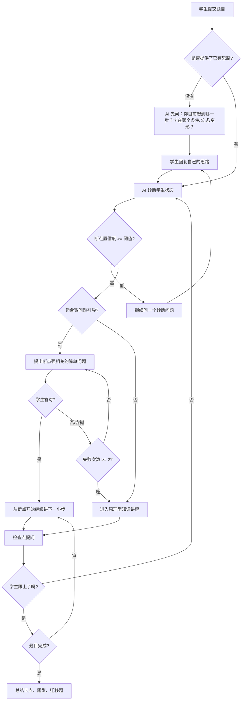
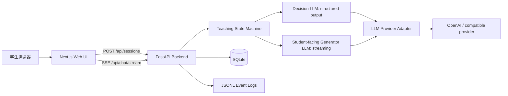

# 诊断式答疑 Agent MVP 开发前文档

版本：v0.1  
日期：2026-07-07  
目标读者：产品、算法、前后端开发、参与测试的教研/运营同学  

> 文档状态：历史设计基线。本文保留立项时的假设、草案和里程碑，不代表当前接口、目录或教学 action。现行实现请从 `docs/README.md` 进入。

## 1. 一句话定义

做一个面向中国初中、高中学生的“诊断式答疑”小 demo：学生不是一发题目 AI 就从头讲题，而是 AI 先追问学生已经想到哪里、具体卡在哪里，再从断点开始用小问题、拆解、知识讲解和总结帮助学生继续往下走。

核心差异不是“讲得更完整”，而是“更快找到学生当前的真实断点，并只从断点处开始补”。

## 2. MVP 要验证的问题

### 2.1 产品假设

传统讲题产品通常默认学生没有完整理解题目，因此会从题目条件、公式、步骤开始完整讲解。这个方式对“完全不会”的学生有用，但对“做到一半卡住”的学生会有几个问题：

1. 学生需要听很多已经会的内容，耐心下降。
2. AI 可能没有发现学生真正的错误点，只是给出标准答案。
3. 学生看懂了解答，但不一定修复自己的思路断点。

本 MVP 要验证：如果 AI 先扮演提问者，诊断学生原有思路，再从断点处讲解，是否比传统从头讲题更有效。

### 2.2 验证指标

效果指标：

1. 学生主观评分：是否觉得“讲到了我卡住的地方”，1-5 分。
2. 断点命中率：人工复核 AI 判断的卡点是否合理，目标 >= 70%。
3. 继续解题成功率：经过答疑后，学生能否完成原题后续步骤，目标比传统讲题模式提升 >= 15%。
4. 相似题迁移：答疑结束后给一道同类小题，学生能否独立做出关键步骤。
5. 无效讲解比例：学生标记“这部分我已经会了”的内容占比，目标低于传统模式。

实时性指标：

1. 首 token 时间 TTFT：P50 <= 2.5 秒，P95 <= 6 秒。
2. 首个诊断问题生成完成时间：P50 <= 5 秒，P95 <= 10 秒。
3. 普通一轮答疑完整响应时间：P50 <= 12 秒，P95 <= 25 秒。
4. 每轮后端决策耗时、模型耗时、流式输出耗时都要可记录。

### 2.3 MVP 不验证的内容

1. 不验证完整题库覆盖。
2. 不验证长期学习路径规划。
3. 不做复杂账号系统。
4. 不做家长端、教师端。
5. 不做语音实时陪练。
6. 不追求完全自动批改所有学科大题。

## 3. 关键产品判断：这不是传统 tool-calling Agent

用户原始设想里有 4 个“工具”：

1. 向学生提问，检测学生是否跟上思路。
2. 拆解问题，把复杂问题拆成基础问题，或从断点处提出强相关的小问题。
3. 知识讲解，如果小问题也没解决，就进入完整知识讲解。
4. 最后总结卡点、相似题型等内容。

这里最重要的产品判断是：它们不应该全部实现成 LLM 可多次调用的 tools。

原因：

1. “向学生提问”本身就是一次 assistant turn 的结束。AI 一旦问了学生，就应该等待学生回复，而不是在同一轮继续调用别的工具。
2. “知识讲解”和“总结”也是面向学生的输出动作，不是一个隐藏工具返回值。
3. 真正需要程序控制的是“当前应该进入哪种教学动作”，而不是让模型自由多次 tool-call。

因此 MVP 应采用：

> 确定性教学状态机 + LLM 结构化决策 + 流式学生可见输出

四个“工具”改称为四类“教学动作”：

| 教学动作 | 英文枚举 | 是否结束当前轮 | 用途 |
|---|---|---:|---|
| 向学生提问 | `ASK_STUDENT` | 是 | 追问思路、判断是否跟上、制造检查点 |
| 拆解/微问题 | `DECOMPOSE_OR_MICRO_QUESTION` | 通常是 | 把断点变成一个很小的问题，让学生能迈下一步 |
| 知识讲解 | `EXPLAIN_KNOWLEDGE` | 否/可继续检查 | 原理处讲清楚，再回到题目 |
| 总结 | `SUMMARIZE` | 是 | 总结卡点、方法、同类题、下一步练习 |

另有两个内部动作，不直接展示给学生：

| 内部动作 | 英文枚举 | 用途 |
|---|---|---|
| 学生状态诊断 | `DIAGNOSE_STUDENT_STATE` | 判断学生会什么、卡什么、错因是什么、置信度 |
| 下一步教学决策 | `SELECT_NEXT_ACTION` | 在提问、微问题、讲解、总结之间选择 |

## 4. 核心用户流程

### 4.1 入口

学生进入 demo 后看到一个实际可用的答疑界面，而不是营销页。

首屏包含：

1. 题目输入区：支持文字输入，MVP 可先支持图片上传但不做复杂公式 OCR，图片交给多模态模型识别。
2. 年级/学科选择：初中数学、初中物理、高中数学、高中物理优先。
3. 学生当前思路输入：可选，但界面要鼓励学生写“我做到哪一步了”。
4. 模式切换：诊断式答疑 / 传统讲题。用于 A/B 验证。

### 4.2 诊断式答疑主流程



### 4.3 传统讲题对照流程

传统模式只用于对照实验：

1. 学生提交题目。
2. AI 直接从头给出完整讲解。
3. 末尾问学生是否懂了。
4. 同样记录延迟、满意度、完成情况。

传统模式不需要优化到极致，只需要代表“常见从头讲题体验”。

## 5. 教学状态机设计

### 5.1 状态枚举

```ts
type TeachingPhase =
  | "intake"
  | "diagnosing"
  | "scaffolding"
  | "explaining"
  | "checking"
  | "summarizing"
  | "ended";
```

### 5.2 动作枚举

```ts
type PedagogicalAction =
  | "ASK_STUDENT"
  | "DECOMPOSE_OR_MICRO_QUESTION"
  | "EXPLAIN_KNOWLEDGE"
  | "SUMMARIZE"
  | "DIRECT_EXPLAIN_BASELINE";
```

### 5.3 后端决策输出结构

LLM 不直接随意输出下一轮内容，而是先返回结构化决策。后端校验后再进入对应动作。

```json
{
  "phase": "diagnosing",
  "action": "ASK_STUDENT",
  "breakpoint": {
    "description": "学生知道要用二次函数顶点式，但不清楚为什么最大值出现在顶点",
    "knowledge_point": "二次函数图像与顶点",
    "confidence": 0.74
  },
  "student_state": {
    "known": ["能读出题目条件", "知道要找最大值"],
    "unknown_or_wrong": ["不理解顶点代表函数最值"],
    "affective_signal": "normal"
  },
  "next_student_visible_output": {
    "style": "question",
    "content": "你已经想到要找最大值了。先确认一个小点：如果一个二次函数开口向下，它的图像最高点会在什么位置？"
  },
  "stop_for_student_reply": true,
  "telemetry_tags": ["diagnostic_question", "quadratic_vertex"]
}
```

### 5.4 强制规则

为了避免模型变成“自由发挥的老师”，状态机需要硬规则：

1. 学生没有提供任何思路时，第一轮最多问 2 个澄清问题，不直接长篇讲解。
2. 诊断轮最多连续 2 轮。超过后必须给出一个微问题或最小提示，避免学生被一直追问。
3. 同一个微问题连续失败 2 次后，进入知识讲解，不继续逼问。
4. 每次讲解最多讲一个概念或一个推理跳步，然后插入检查点问题。
5. 面向学生的单轮输出尽量控制在 80-180 字；原理讲解可放宽到 300 字内。
6. 禁止直接说“你错了”。应该说“这里可能卡在……”或“这一步我们单独看一下”。
7. 解题完成后必须总结，不以“答案是……”结束。

## 6. 教学动作细节

### 6.1 `ASK_STUDENT`

目的：收集学生思路或检查是否跟上。

适用场景：

1. 学生只发题，没有说自己怎么想。
2. 学生说“不会”，但没有暴露具体卡点。
3. AI 讲完一小步，需要确认学生是否理解。
4. AI 对断点置信度不足。

输出要求：

1. 只问 1 个主问题，最多带 1 个补充选项。
2. 问题必须与题目当前断点强相关。
3. 避免泛泛地问“你哪里不会”。

示例：

> 你已经把受力图画出来了，我们先只看水平方向：这个物体在水平方向上一共有哪几个力？你可以直接列名字。

### 6.2 `DECOMPOSE_OR_MICRO_QUESTION`

目的：把复杂步骤变成学生能回答的低门槛问题。

适用场景：

1. 已经发现断点，但学生未必需要完整知识讲解。
2. 学生差一步就能继续。
3. 希望学生自己说出关键桥梁。

输出要求：

1. 只拆当前断点，不拆整道题。
2. 问题要足够小，学生可以 10-30 秒内尝试回答。
3. 如果涉及公式，要先问公式含义或变量关系，不急着代数计算。

示例：

> 先不算整题。只看这个式子 `v = at`：如果初速度是 0，加速度一定，时间变成原来的 2 倍，速度会变成几倍？

### 6.3 `EXPLAIN_KNOWLEDGE`

目的：微问题失败后，从原理处补知识。

适用场景：

1. 学生连续答错或答不出微问题。
2. 学生暴露的是概念缺失，不是计算失误。
3. 题目必须依赖某个基础原理。

输出结构：

1. 先说当前卡点。
2. 再讲原理。
3. 然后回到题目中的这一处。
4. 最后给一个检查点问题。

示例结构：

> 这里卡的不是代数计算，而是“为什么顶点代表最大值”。  
> 二次函数开口向下时，图像像一座拱桥，最高点就是顶点。函数值就是图像上点的高度，所以最大函数值出现在顶点。  
> 回到这道题，式子整理成顶点式后，括号平方那一项最小是 0，因此整体最大值就在这一项为 0 的时候。  
> 你试一下：如果 `(x-3)^2` 最小是 0，那么 `-2(x-3)^2+5` 最大是多少？

### 6.4 `SUMMARIZE`

目的：让学生带走可迁移的东西，而不是只拿到答案。

总结内容：

1. 本题真正卡点。
2. 正确的关键桥梁。
3. 相似题型识别信号。
4. 下次遇到时的第一步。
5. 一道极简迁移题，可选。

示例：

> 这题你的主要卡点是：知道要找最大值，但没把“最大值”和“图像顶点”连起来。  
> 以后看到“二次函数最大/最小值”，先判断开口方向，再找顶点。开口向下找最大值，开口向上找最小值。  
> 同类题常见关键词：最大利润、最远距离、最小面积、最省材料。  
> 你可以再试一个小题：`y = -3(x+1)^2 + 7` 的最大值是多少？

## 7. 推荐 MVP 技术栈

### 7.1 总体选择

MVP 推荐做成一个前后端分离但同仓库管理的小项目：

| 层 | 选择 | 原因 |
|---|---|---|
| 开发环境 | Windows/macOS/Linux 均可，Node.js 24 LTS，Python 3.12+ | Node 24 当前是 Active LTS；Python 生态更适合快速写 LLM 编排与评估脚本 |
| 前端语言 | TypeScript | 聊天状态、事件流、结构化响应更需要类型约束 |
| 前端框架 | Next.js App Router + React | 方便做可视化界面、服务端渲染、路由与 API 代理 |
| UI | Tailwind CSS + shadcn/ui 或 Radix UI | 快速搭建干净的 demo 组件 |
| 后端语言 | Python | LLM 编排、评估、日志处理、实验脚本更直接 |
| 后端框架 | FastAPI | 原生支持 async，容易做 SSE/WebSocket/API docs |
| 流式传输 | SSE 优先，WebSocket 备选 | 当前场景主要是服务端向前端流式输出，SSE 足够；需要打断/语音时再上 WebSocket |
| 数据存储 | SQLite + SQLModel/SQLAlchemy | MVP 本地可跑、可导出实验数据；后续平滑迁移 PostgreSQL |
| LLM 接入 | OpenAI Responses API 优先，保留 OpenAI-compatible Provider Adapter | 支持流式响应、结构化输出；国内网络或成本问题可替换供应商 |
| 观测 | JSONL 事件日志 + 前端实验面板 | MVP 先保证每轮可复盘，不急着接复杂 APM |
| 测试 | Pytest + Vitest/Playwright | 后端测状态机，前端测关键流程和响应渲染 |

### 7.2 为什么不是全栈 Next.js

全栈 Next.js 也能完成 demo，但本产品的核心风险在“教学流程编排、结构化诊断、评估脚本”，Python 更适合快速迭代这些逻辑。前端保留 Next.js，后端用 FastAPI，可以让 UI 和教学引擎边界清楚。

### 7.3 为什么 MVP 先不用 LangGraph

LangGraph 适合长运行、有持久状态、human-in-the-loop、流式和复杂 agent orchestration 的场景。但当前 MVP 的关键不是多 agent 协作，而是验证“诊断式答疑”是否有效。先用手写状态机更透明、更容易做实验对照。

如果后续出现这些情况，再考虑引入 LangGraph：

1. 教学状态超过 10 个，并且分支复杂。
2. 需要恢复长会话、跨题记忆、可回放执行轨迹。
3. 需要多个专门 agent，比如诊断 agent、讲解 agent、出题 agent、评估 agent。

## 8. 系统架构



### 8.1 前端页面

建议路由：

```txt
apps/web/
  app/
    page.tsx                  # 答疑 demo 首页
    session/[id]/page.tsx      # 单次答疑会话
    admin/evals/page.tsx       # 简单实验结果面板
  components/
    ChatPanel.tsx
    ProblemInput.tsx
    DiagnosisPanel.tsx
    ExperimentToggle.tsx
    LatencyBadge.tsx
```

首屏布局：

1. 左侧：题目、年级、学科、模式选择。
2. 中间：聊天主界面。
3. 右侧：MVP 调试面板，显示当前阶段、AI 判断的卡点、置信度、耗时、token 数。

右侧调试面板是内部测试用，正式给学生时可隐藏。

### 8.2 后端目录

```txt
apps/api/
  app/
    main.py
    routes/
      sessions.py
      chat.py
      evals.py
    core/
      state_machine.py
      policies.py
      schemas.py
      prompt_templates.py
    llm/
      provider_base.py
      openai_provider.py
    storage/
      db.py
      models.py
      event_log.py
    tests/
      test_state_machine.py
      test_policy_limits.py
```

### 8.3 API 草案

创建会话：

```http
POST /api/sessions
```

请求：

```json
{
  "grade": "junior_3",
  "subject": "math",
  "mode": "diagnostic",
  "problem_text": "题目文字",
  "student_initial_thought": "我想到要设 x，但不知道怎么列式"
}
```

响应：

```json
{
  "session_id": "sess_123",
  "phase": "intake"
}
```

发送学生消息并接收流式输出：

```http
POST /api/chat/stream
Accept: text/event-stream
```

SSE 事件类型：

```txt
decision          # 后端已选择教学动作
message_delta     # 学生可见文本增量
message_done      # 当前 assistant turn 结束
state_update      # 当前阶段、断点、置信度更新
metric            # TTFT、模型耗时、token 估算等
error             # 错误信息
```

## 9. LLM 调用策略

### 9.1 两段式调用

一轮对话建议拆成两步：

1. 决策调用：非流式，返回结构化 JSON，用于判断教学动作。
2. 生成调用：流式，输出给学生看的自然语言。

这样做的好处：

1. 状态机可控。
2. 日志可分析。
3. 可以单独评估“断点诊断是否准确”。
4. 学生端仍然有流式即时反馈。

### 9.2 模型配置

通过环境变量配置，不把模型名写死在业务代码里：

```env
OPENAI_API_KEY=
OPENAI_BASE_URL=
LLM_MODEL_DECISION=gpt-5.5
LLM_MODEL_GENERATION=gpt-5.5
LLM_MODEL_FAST=
```

说明：

1. 官方文档在 2026-07-07 显示最新模型入口为 GPT-5.5，但实际开发时仍应以账号可用模型和价格为准。
2. 决策调用要求结构化输出稳定，可以先用强模型。
3. 生成调用要求延迟低，可以测试强模型与低成本模型的差异。
4. 如果国内访问延迟不稳定，保留 `OPENAI_BASE_URL` 用于兼容其他供应商。

### 9.3 结构化输出

对 `DIAGNOSE_STUDENT_STATE` 和 `SELECT_NEXT_ACTION` 使用 JSON Schema 严格约束，字段至少包括：

1. `phase`
2. `action`
3. `breakpoint.description`
4. `breakpoint.knowledge_point`
5. `breakpoint.confidence`
6. `stop_for_student_reply`
7. `student_visible_output`
8. `telemetry_tags`

### 9.4 Prompt 分层

建议拆成 4 类 prompt：

1. `system_tutor_principles`：教学原则，不羞辱学生，不长篇灌输，从断点开始。
2. `diagnosis_prompt`：根据题目、学生思路和历史对话判断断点。
3. `action_policy_prompt`：选择下一步教学动作。
4. `student_response_prompt`：生成学生可见文本，控制字数和语气。

## 10. 数据记录与评估

### 10.1 必须记录的数据

每轮记录：

```json
{
  "session_id": "sess_123",
  "turn_id": 4,
  "timestamp": "2026-07-07T12:00:00+08:00",
  "mode": "diagnostic",
  "subject": "math",
  "grade": "junior_3",
  "phase_before": "diagnosing",
  "phase_after": "scaffolding",
  "action": "DECOMPOSE_OR_MICRO_QUESTION",
  "breakpoint": "不理解顶点代表最大值",
  "breakpoint_confidence": 0.74,
  "latency": {
    "decision_ms": 1800,
    "ttft_ms": 2300,
    "complete_ms": 8200
  },
  "student_feedback": null,
  "token_usage": {
    "input": 1200,
    "output": 260
  }
}
```

### 10.2 学生反馈控件

每个 assistant turn 下面放 3 个轻量反馈按钮：

1. “讲到我卡点了”
2. “这段我已经会了”
3. “我还是没懂”

每次总结后追加 2 个问题：

1. 这次答疑对你有没有帮助？1-5 分。
2. AI 找到你的卡点了吗？是/否/不确定。

### 10.3 A/B 实验设计

实验对象：

1. 8-20 名初高中学生即可做第一轮可用性验证。
2. 每人 4-6 道题，题目难度控制在“会一部分但容易卡”的区间。

实验方式：

1. 同一学生交替使用传统讲题模式和诊断式答疑模式。
2. 题目按难度配对，避免某一模式拿到明显更简单的题。
3. 每道题记录完成时间、求助轮数、满意度、迁移题表现。
4. 测试后人工复盘 20-50 个 session，标注断点是否命中。

判定标准：

1. 如果诊断式模式在“卡点命中感”和“迁移题表现”明显更好，即使总时长略长，也值得继续。
2. 如果诊断式模式让学生觉得被追问烦，说明提问轮次和问题质量要优化。
3. 如果延迟主要来自首轮诊断，要考虑先快速问一个轻量问题，再后台完善诊断。

## 11. MVP 里程碑

### 第 1 阶段：可跑通

目标：本地打开网页，可以完成一轮诊断式答疑。

任务：

1. 建立 Next.js 前端和 FastAPI 后端。
2. 完成 session 创建、聊天输入、SSE 流式输出。
3. 手写教学状态机 v0。
4. 接入 LLM provider adapter。
5. 保存 JSONL 日志。

验收：

1. 输入一道题和学生思路，AI 能先问一个相关诊断问题。
2. 学生回复后，AI 能从断点继续。
3. 右侧调试面板显示 phase、action、breakpoint、latency。

### 第 2 阶段：可对照

目标：同一 demo 可切换传统讲题和诊断式答疑。

任务：

1. 增加传统讲题 baseline prompt。
2. 增加反馈按钮。
3. 增加评估数据导出。
4. 准备 20 道初高中数学/物理测试题。

验收：

1. 同一题可以分别跑 baseline 和 diagnostic。
2. 能导出 CSV/JSONL，包含模式、耗时、反馈、动作路径。

### 第 3 阶段：小样本验证

目标：用真实学生或内部模拟学生验证产品方向。

任务：

1. 组织 8-20 名学生测试。
2. 人工标注断点命中率。
3. 分析满意度、完成率、延迟。
4. 输出是否继续投入的结论。

验收：

1. 至少 50 个有效答疑 session。
2. 有对照数据。
3. 有明确继续/调整/停止建议。

## 12. 风险与应对

| 风险 | 表现 | MVP 应对 |
|---|---|---|
| AI 一直追问，学生烦 | 学生觉得不如直接给答案 | 限制连续诊断轮数，最多 2 轮必须给帮助 |
| AI 判断错断点 | 从错误地方讲，学生更迷糊 | 显示“我理解你可能卡在…”并允许学生纠正 |
| 讲解还是太长 | 又变成传统讲题 | 单轮字数限制，每次只讲一个断点 |
| 延迟过高 | 学生等待焦虑 | SSE 流式输出，首轮可先快速问诊断问题 |
| 学生只想抄答案 | 不参与回答 | 允许“直接看答案”但单独标记，不混入诊断效果数据 |
| 未成年人隐私 | 图片里可能有姓名、学校 | 不要求登录，不收集真实姓名，图片和日志设置短期保留 |
| 学科覆盖不稳 | 复杂题 AI 解错 | MVP 先限定数学/物理高频题型，人工复核测试题 |

## 13. 开发启动清单

环境：

1. Node.js 24 LTS
2. pnpm
3. Python 3.12+
4. uv 或 poetry
5. SQLite

前端：

1. Next.js App Router
2. TypeScript
3. Tailwind CSS
4. shadcn/ui 或 Radix UI
5. Playwright

后端：

1. FastAPI
2. Uvicorn
3. Pydantic
4. SQLModel 或 SQLAlchemy
5. OpenAI Python SDK
6. Pytest

配置：

```env
OPENAI_API_KEY=
OPENAI_BASE_URL=
LLM_MODEL_DECISION=
LLM_MODEL_GENERATION=
DATABASE_URL=sqlite:///./data/mvp.db
LOG_PATH=./logs/events.jsonl
```

## 14. 推荐的第一版页面文案

题目输入区：

> 把题目发上来，也可以顺手写一句：你已经想到哪一步、卡在哪里。

学生思路占位：

> 例：我知道要用函数，但不知道为什么这里能取最大值。

诊断式模式提示：

> AI 会先问你 1-2 个小问题，确认你的卡点，再从那里开始讲。

传统模式提示：

> AI 会直接从头讲完整解法，用作对照测试。

反馈按钮：

1. 讲到我卡点了
2. 这段我已经会了
3. 我还是没懂

## 15. 结论

这个 MVP 的核心不是做一个“更像 agent 的 agent”，而是做一个“受控的诊断式教学流程”。模型负责理解题目、诊断断点、生成自然语言；程序负责轮次、状态、动作边界、日志和实验对照。

第一版只要能稳定跑通下面 4 件事，就足够验证方向：

1. 学生提交题目和半成品思路。
2. AI 先提出高质量诊断问题。
3. AI 能从断点开始讲，而不是从头讲。
4. 系统能记录效果与延迟，并与传统讲题模式对照。

## 16. 技术依据与参考

1. Next.js App Router 官方文档：https://nextjs.org/docs/app
2. FastAPI StreamingResponse 官方文档：https://fastapi.tiangolo.com/advanced/custom-response/#streamingresponse
3. FastAPI WebSocket 官方文档：https://fastapi.tiangolo.com/advanced/websockets/
4. OpenAI Streaming Responses 官方文档：https://developers.openai.com/api/docs/guides/streaming-responses
5. OpenAI Structured Outputs 官方文档：https://developers.openai.com/api/docs/guides/structured-outputs
6. Node.js Release Working Group 发布周期：https://github.com/nodejs/release#release-schedule
7. LangGraph 官方概览：https://docs.langchain.com/oss/python/langgraph/overview
